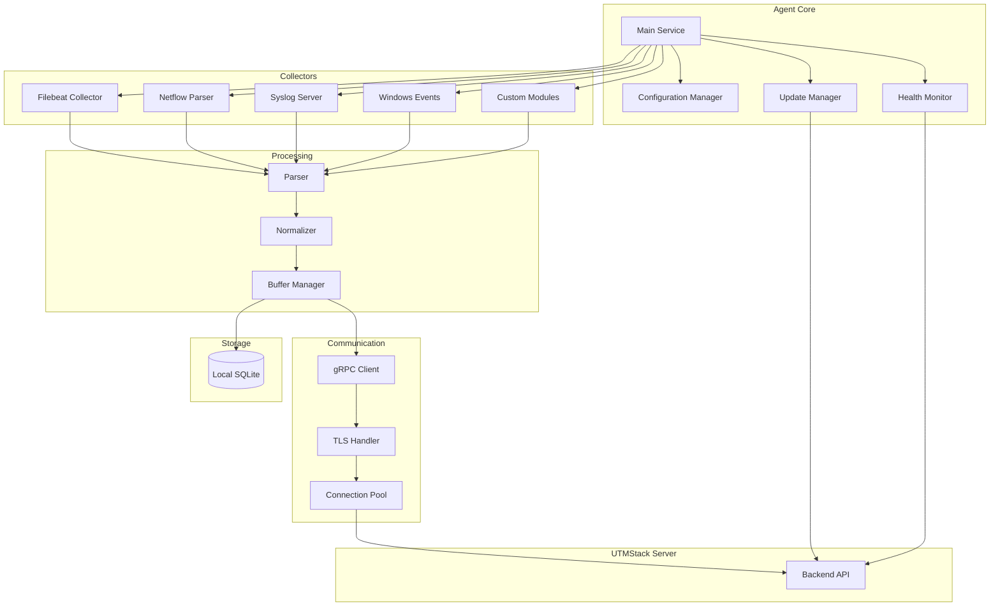

The UTMStack agent is a lightweight, high-performance data collection system written in Go. It runs on monitored systems to collect logs, network traffic, and security events, then securely transmits them to the UTMStack server.

## Overview

The agent is designed with the following principles:

- **Low Resource Footprint**: Minimal CPU and memory usage
- **Cross-Platform**: Supports Windows, Linux, and macOS
- **Secure Communication**: TLS-encrypted gRPC with certificate authentication
- **Reliable Delivery**: Local buffering with automatic retry
- **Self-Updating**: Automatic updates without service interruption
- **Modular Architecture**: Plugin-based collectors for different data sources

## Architecture



## Technology Stack

### Core Technologies
- **Language**: Go 1.21+
- **Protocol**: gRPC with Protocol Buffers
- **Database**: SQLite (local buffering)
- **Encryption**: TLS 1.2+

### Key Libraries

```go
import (
    "google.golang.org/grpc"
    "google.golang.org/protobuf/proto"
    "github.com/mattn/go-sqlite3"
    "github.com/elastic/beats/filebeat"
    "github.com/sirupsen/logrus"
)
```

## Installation and Configuration

### Installation Process

**From source code** (`~/workspace/source/agent/main.go:40-91`):

```go
func installAgent() {
    // 1. Get initial configuration
    cnf, utmKey := config.GetInitialConfig()
    
    // 2. Check server connection
    fmt.Print("Checking server connection ... ")
    if err := utils.ArePortsReachable(cnf.Server, 
        config.AgentManagerPort, 
        config.LogAuthProxyPort, 
        config.DependenciesPort); err != nil {
        fmt.Println("\nError trying to connect to server: ", err)
        os.Exit(1)
    }
    fmt.Println("[OK]")
    
    // 3. Download dependencies (collectors, parsers)
    fmt.Print("Downloading dependencies ... ")
    if err := updates.DownloadFirstDependencies(cnf.Server, 
        cnf.SkipCertValidation); err != nil {
        fmt.Println("\nError downloading dependencies: ", err)
        os.Exit(1)
    }
    fmt.Println("[OK]")
    
    // 4. Register with server
    fmt.Print("Configuring agent ... ")
    err = pb.RegisterAgent(cnf, utmKey)
    if err != nil {
        fmt.Println("\nError registering agent: ", err)
        os.Exit(1)
    }
    
    // 5. Save configuration
    if err = config.SaveConfig(cnf); err != nil {
        fmt.Println("\nError saving config: ", err)
        os.Exit(1)
    }
    
    // 6. Configure collectors
    if err = modules.ConfigureCollectorFirstTime(); err != nil {
        fmt.Println("\nError configuring collector: ", err)
        os.Exit(1)
    }
    
    // 7. Install collectors
    if err = collectors.InstallCollectors(); err != nil {
        fmt.Println("\nError installing beats: ", err)
        os.Exit(1)
    }
    
    // 8. Set data retention
    if err := logservice.SetDataRetention(""); err != nil {
        fmt.Println("\nError setting retention: ", err)
        os.Exit(1)
    }
    
    // 9. Install as system service
    fmt.Print(("Creating service ... "))
    serv.InstallService()
    fmt.Println("[OK]")
}
```

### Configuration Structure

```go
type AgentConfig struct {
    // Server connection
    Server              string `json:"server"`
    AgentKey            string `json:"agent_key"`
    SkipCertValidation bool   `json:"skip_cert_validation"`
    
    // Agent identification
    AgentID             string `json:"agent_id"`
    AgentName           string `json:"agent_name"`
    AgentType           string `json:"agent_type"`
    
    // Collector settings
    Collectors          []CollectorConfig `json:"collectors"`
    
    // Performance settings
    BufferSize          int    `json:"buffer_size"`
    BatchSize           int    `json:"batch_size"`
    FlushInterval       int    `json:"flush_interval_seconds"`
    
    // Logging
    LogLevel            string `json:"log_level"`
    LogFile             string `json:"log_file"`
}
```

## Data Collection Modules

### 1. Filebeat Collector

Integrates with Elastic Filebeat for log file collection:

```go
type FilebeatCollector struct {
    config      *FilebeatConfig
    client      *filebeat.Client
    running     bool
    mu          sync.RWMutex
}

func (fc *FilebeatCollector) Start() error {
    fc.mu.Lock()
    defer fc.mu.Unlock()
    
    if fc.running {
        return errors.New("filebeat already running")
    }
    
    // Configure filebeat
    config := filebeat.Config{
        Inputs: fc.config.Inputs,
        Output: filebeat.OutputConfig{
            Type: "grpc",
            Hosts: []string{fc.config.Server},
        },
        Processors: []map[string]interface{}{
            {
                "add_host_metadata": map[string]interface{}{
                    "when.not.contains.tags": "forwarded",
                },
            },
            {
                "add_cloud_metadata": map[string]interface{}{},
            },
        },
    }
    
    fc.client = filebeat.New(config)
    fc.running = true
    
    return fc.client.Start()
}
```

**Configuration Example**:
```yaml
filebeat.inputs:
- type: log
  enabled: true
  paths:
    - /var/log/syslog
    - /var/log/auth.log
  fields:
    log_type: system
    
- type: log
  enabled: true
  paths:
    - /var/log/nginx/access.log
  fields:
    log_type: web_access
  multiline:
    pattern: '^\['
    negate: true
    match: after
```

### 2. Netflow Parser

Parses network flow data from routers and switches:

**Supported Protocols** (from `~/workspace/source/agent/parser/netflow/`):
- Netflow v1
- Netflow v5
- Netflow v6
- Netflow v7
- Netflow v9
- IPFIX

```go
type NetflowParser struct {
    listener    net.PacketConn
    templates   *TemplateCache
    processor   *FlowProcessor
}

func (np *NetflowParser) Listen(address string, port int) error {
    addr := fmt.Sprintf("%s:%d", address, port)
    conn, err := net.ListenPacket("udp", addr)
    if err != nil {
        return err
    }
    
    np.listener = conn
    
    go np.processPackets()
    return nil
}

func (np *NetflowParser) processPackets() {
    buffer := make([]byte, 65535)
    
    for {
        n, addr, err := np.listener.ReadFrom(buffer)
        if err != nil {
            log.Error("Error reading packet:", err)
            continue
        }
        
        // Determine version
        version := binary.BigEndian.Uint16(buffer[0:2])
        
        switch version {
        case 5:
            np.parseNetflowV5(buffer[:n], addr)
        case 9:
            np.parseNetflowV9(buffer[:n], addr)
        case 10: // IPFIX
            np.parseIPFIX(buffer[:n], addr)
        default:
            log.Warnf("Unsupported Netflow version: %d", version)
        }
    }
}
```

**Flow Record Structure**:
```go
type FlowRecord struct {
    Timestamp       time.Time
    SourceIP        net.IP
    DestinationIP   net.IP
    SourcePort      uint16
    DestinationPort uint16
    Protocol        uint8
    Packets         uint64
    Bytes           uint64
    TCPFlags        uint8
    InputInterface  uint32
    OutputInterface uint32
    NextHop         net.IP
    SrcAS           uint32
    DstAS           uint32
    SrcMask         uint8
    DstMask         uint8
}
```

### 3. Syslog Server

Receives syslog messages from network devices:

```go
type SyslogServer struct {
    tcpListener net.Listener
    udpConn     *net.UDPConn
    tlsConfig   *tls.Config
    parser      *SyslogParser
}

func (ss *SyslogServer) Start(config *SyslogConfig) error {
    // Start UDP listener
    if config.EnableUDP {
        addr, _ := net.ResolveUDPAddr("udp", fmt.Sprintf(":%d", config.UDPPort))
        conn, err := net.ListenUDP("udp", addr)
        if err != nil {
            return err
        }
        ss.udpConn = conn
        go ss.handleUDP()
    }
    
    // Start TCP listener
    if config.EnableTCP {
        listener, err := net.Listen("tcp", fmt.Sprintf(":%d", config.TCPPort))
        if err != nil {
            return err
        }
        ss.tcpListener = listener
        go ss.handleTCP()
    }
    
    // Start TLS listener
    if config.EnableTLS {
        ss.tlsConfig = ss.loadTLSConfig(config.CertFile, config.KeyFile)
        listener, err := tls.Listen("tcp", fmt.Sprintf(":%d", config.TLSPort), ss.tlsConfig)
        if err != nil {
            return err
        }
        go ss.handleTLS(listener)
    }
    
    return nil
}
```

**Syslog Parsing**:
```go
func (sp *SyslogParser) Parse(message []byte) (*SyslogMessage, error) {
    msg := &SyslogMessage{
        RawMessage: string(message),
        ReceivedAt: time.Now(),
    }
    
    // Try RFC 5424 format first
    if msg.Priority, msg.Version, msg.Timestamp, msg.Hostname, msg.AppName, 
       msg.ProcID, msg.MsgID, msg.StructuredData, msg.Message = 
       sp.parseRFC5424(message); msg.Version > 0 {
        return msg, nil
    }
    
    // Fall back to RFC 3164
    if msg.Priority, msg.Timestamp, msg.Hostname, msg.Tag, msg.Message = 
       sp.parseRFC3164(message); msg.Timestamp != nil {
        msg.Version = 0 // RFC 3164
        return msg, nil
    }
    
    return nil, errors.New("unable to parse syslog message")
}
```

## gRPC Communication

### Protocol Buffer Definition

```protobuf
syntax = "proto3";

package utmstack.agent;

service AgentService {
  // Agent registration
  rpc RegisterAgent(RegistrationRequest) returns (RegistrationResponse);
  
  // Bidirectional log streaming
  rpc StreamLogs(stream LogBatch) returns (stream LogResponse);
  
  // Configuration updates
  rpc GetConfiguration(ConfigRequest) returns (AgentConfig);
  
  // Command execution
  rpc ExecuteCommand(CommandRequest) returns (CommandResponse);
  
  // Health reporting
  rpc ReportHealth(HealthStatus) returns (HealthResponse);
}

message LogBatch {
  string agent_id = 1;
  repeated LogEvent events = 2;
  int64 timestamp = 3;
  string batch_id = 4;
}

message LogEvent {
  string id = 1;
  int64 timestamp = 2;
  string source = 3;
  string source_type = 4;
  string message = 5;
  map<string, string> fields = 6;
  bytes raw_data = 7;
}
```

### Client Implementation

```go
type GRPCClient struct {
    conn       *grpc.ClientConn
    client     pb.AgentServiceClient
    config     *AgentConfig
    stream     pb.AgentService_StreamLogsClient
    mu         sync.RWMutex
}

func NewGRPCClient(config *AgentConfig) (*GRPCClient, error) {
    // Load TLS credentials
    creds, err := credentials.NewClientTLSFromFile(
        config.CertFile,
        config.ServerName,
    )
    if err != nil {
        return nil, err
    }
    
    // Create connection
    conn, err := grpc.Dial(
        config.Server,
        grpc.WithTransportCredentials(creds),
        grpc.WithKeepaliveParams(keepalive.ClientParameters{
            Time:                10 * time.Second,
            Timeout:             3 * time.Second,
            PermitWithoutStream: true,
        }),
        grpc.WithDefaultCallOptions(
            grpc.MaxCallRecvMsgSize(50*1024*1024), // 50MB
            grpc.MaxCallSendMsgSize(50*1024*1024),
        ),
    )
    if err != nil {
        return nil, err
    }
    
    return &GRPCClient{
        conn:   conn,
        client: pb.NewAgentServiceClient(conn),
        config: config,
    }, nil
}

func (gc *GRPCClient) StreamLogs() error {
    stream, err := gc.client.StreamLogs(context.Background())
    if err != nil {
        return err
    }
    
    gc.mu.Lock()
    gc.stream = stream
    gc.mu.Unlock()
    
    // Start receiving responses
    go gc.receiveResponses(stream)
    
    return nil
}

func (gc *GRPCClient) SendBatch(batch *pb.LogBatch) error {
    gc.mu.RLock()
    defer gc.mu.RUnlock()
    
    if gc.stream == nil {
        return errors.New("stream not initialized")
    }
    
    return gc.stream.Send(batch)
}
```

## Local Buffering

### SQLite Buffer

```go
type BufferManager struct {
    db         *sql.DB
    maxSize    int64
    mu         sync.RWMutex
}

func (bm *BufferManager) Init(dbPath string, maxSize int64) error {
    db, err := sql.Open("sqlite3", dbPath)
    if err != nil {
        return err
    }
    
    // Create table
    _, err = db.Exec(`
        CREATE TABLE IF NOT EXISTS event_buffer (
            id INTEGER PRIMARY KEY AUTOINCREMENT,
            batch_id TEXT NOT NULL,
            event_data BLOB NOT NULL,
            created_at INTEGER NOT NULL,
            retry_count INTEGER DEFAULT 0
        );
        CREATE INDEX IF NOT EXISTS idx_created_at ON event_buffer(created_at);
    `)
    if err != nil {
        return err
    }
    
    bm.db = db
    bm.maxSize = maxSize
    
    return nil
}

func (bm *BufferManager) Store(batch *pb.LogBatch) error {
    bm.mu.Lock()
    defer bm.mu.Unlock()
    
    // Check buffer size
    if err := bm.checkSize(); err != nil {
        return err
    }
    
    // Serialize batch
    data, err := proto.Marshal(batch)
    if err != nil {
        return err
    }
    
    // Store in database
    _, err = bm.db.Exec(
        "INSERT INTO event_buffer (batch_id, event_data, created_at) VALUES (?, ?, ?)",
        batch.BatchId,
        data,
        time.Now().Unix(),
    )
    
    return err
}

func (bm *BufferManager) GetPending(limit int) ([]*pb.LogBatch, error) {
    rows, err := bm.db.Query(
        "SELECT id, event_data FROM event_buffer ORDER BY created_at ASC LIMIT ?",
        limit,
    )
    if err != nil {
        return nil, err
    }
    defer rows.Close()
    
    var batches []*pb.LogBatch
    
    for rows.Next() {
        var id int64
        var data []byte
        
        if err := rows.Scan(&id, &data); err != nil {
            continue
        }
        
        batch := &pb.LogBatch{}
        if err := proto.Unmarshal(data, batch); err != nil {
            continue
        }
        
        batches = append(batches, batch)
    }
    
    return batches, nil
}
```

## Auto-Update Mechanism

```go
type UpdateManager struct {
    currentVersion string
    updateURL      string
    client         *http.Client
}

func (um *UpdateManager) CheckForUpdates() (*VersionInfo, error) {
    resp, err := um.client.Get(um.updateURL + "/version")
    if err != nil {
        return nil, err
    }
    defer resp.Body.Close()
    
    var info VersionInfo
    if err := json.NewDecoder(resp.Body).Decode(&info); err != nil {
        return nil, err
    }
    
    if um.isNewerVersion(info.Version, um.currentVersion) {
        return &info, nil
    }
    
    return nil, nil // No update available
}

func (um *UpdateManager) DownloadAndInstall(version *VersionInfo) error {
    // Download update
    tmpFile, err := um.downloadUpdate(version.DownloadURL)
    if err != nil {
        return err
    }
    defer os.Remove(tmpFile)
    
    // Verify checksum
    if !um.verifyChecksum(tmpFile, version.Checksum) {
        return errors.New("checksum verification failed")
    }
    
    // Stop service
    if err := um.stopService(); err != nil {
        return err
    }
    
    // Replace binary
    if err := um.replaceBinary(tmpFile); err != nil {
        // Rollback
        um.startService()
        return err
    }
    
    // Start service
    return um.startService()
}
```

## Platform-Specific Implementations

The agent has platform-specific code for Windows, Linux, and macOS:

**Configuration Files**:
- `config/windows_amd64.go`
- `config/windows_arm64.go`
- `config/linux_amd64.go`
- `config/linux_arm64.go`
- `config/macos.go`

**Example - Windows Service**:
```go
// +build windows

func InstallService() error {
    exePath, err := os.Executable()
    if err != nil {
        return err
    }
    
    m, err := mgr.Connect()
    if err != nil {
        return err
    }
    defer m.Disconnect()
    
    s, err := m.CreateService(
        "UTMStackAgent",
        exePath,
        mgr.Config{
            DisplayName: "UTMStack Agent",
            Description: "UTMStack security monitoring agent",
            StartType:   mgr.StartAutomatic,
        },
        "run",
    )
    if err != nil {
        return err
    }
    defer s.Close()
    
    return s.Start()
}
```

## Monitoring and Health

```go
type HealthMonitor struct {
    client      pb.AgentServiceClient
    interval    time.Duration
    metrics     *Metrics
}

func (hm *HealthMonitor) Start() {
    ticker := time.NewTicker(hm.interval)
    
    for range ticker.C {
        status := hm.collectHealthStatus()
        hm.reportHealth(status)
    }
}

func (hm *HealthMonitor) collectHealthStatus() *pb.HealthStatus {
    return &pb.HealthStatus{
        AgentId:           config.AgentID,
        Timestamp:         time.Now().Unix(),
        CpuUsage:          hm.metrics.GetCPUUsage(),
        MemoryUsage:       hm.metrics.GetMemoryUsage(),
        DiskUsage:         hm.metrics.GetDiskUsage(),
        EventsCollected:   hm.metrics.GetEventsCollected(),
        EventsSent:        hm.metrics.GetEventsSent(),
        EventsBuffered:    hm.metrics.GetEventsBuffered(),
        LastError:         hm.metrics.GetLastError(),
        CollectorStatus:   hm.metrics.GetCollectorStatus(),
    }
}
```

## Next Steps

<CardGroup cols={2}>
  <Card title="Backend API" icon="code" href="/architecture/backend-api">
    Learn how the backend processes agent data
  </Card>
  <Card title="Data Flow" icon="diagram-project" href="/architecture/data-flow">
    See how data flows from agents to storage
  </Card>
  <Card title="Correlation Engine" icon="brain" href="/architecture/correlation-engine">
    Understand how collected data is correlated
  </Card>
  <Card title="Performance Tuning" icon="gauge-high" href="/architecture/performance-tuning">
    Optimize agent performance
  </Card>
</CardGroup>