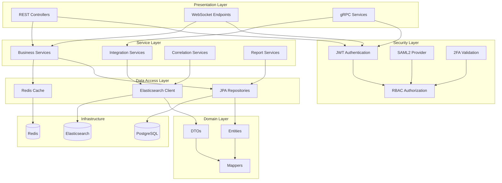

The UTMStack backend API is the central orchestration layer built with Java 17 and Spring Boot 3.1.5. It provides RESTful services, manages business logic, orchestrates data processing, and serves as the integration point for all system components.

## Technology Stack

### Core Framework
- **Java**: Version 17 (LTS)
- **Spring Boot**: 3.1.5
- **JHipster**: 7.3.1 (application generator framework)
- **Build Tool**: Maven 3.3.9+
- **Packaging**: WAR deployment

### Key Dependencies

#### Web & API
```xml
<dependency>
    <groupId>org.springframework.boot</groupId>
    <artifactId>spring-boot-starter-web</artifactId>
</dependency>
<dependency>
    <groupId>org.springdoc</groupId>
    <artifactId>springdoc-openapi-ui</artifactId>
    <version>1.6.15</version>
</dependency>
```

#### Security
```xml
<dependency>
    <groupId>org.springframework.boot</groupId>
    <artifactId>spring-boot-starter-security</artifactId>
</dependency>
<dependency>
    <groupId>org.springframework.security</groupId>
    <artifactId>spring-security-saml2-service-provider</artifactId>
</dependency>
<dependency>
    <groupId>io.jsonwebtoken</groupId>
    <artifactId>jjwt-api</artifactId>
</dependency>
```

#### Data Access
```xml
<dependency>
    <groupId>org.springframework.boot</groupId>
    <artifactId>spring-boot-starter-data-jpa</artifactId>
</dependency>
<dependency>
    <groupId>org.postgresql</groupId>
    <artifactId>postgresql</artifactId>
</dependency>
<dependency>
    <groupId>org.elasticsearch.client</groupId>
    <artifactId>elasticsearch-rest-high-level-client</artifactId>
    <version>7.12.1</version>
</dependency>
```

#### Communication
```xml
<dependency>
    <groupId>io.grpc</groupId>
    <artifactId>grpc-netty</artifactId>
    <version>1.65.1</version>
</dependency>
<dependency>
    <groupId>org.springframework.boot</groupId>
    <artifactId>spring-boot-starter-websocket</artifactId>
</dependency>
```

## Architecture Layers



## API Architecture

### RESTful API Design

The backend follows RESTful principles with consistent patterns:

**Endpoint Structure**:
```
GET    /api/{resource}           # List resources
GET    /api/{resource}/{id}      # Get single resource
POST   /api/{resource}           # Create resource
PUT    /api/{resource}/{id}      # Update resource
DELETE /api/{resource}/{id}      # Delete resource
```

**Example Resources**:
- `/api/alerts` - Security alerts and incidents
- `/api/logs` - Log search and retrieval
- `/api/dashboards` - Dashboard configurations
- `/api/integrations` - Integration modules
- `/api/users` - User management
- `/api/compliance` - Compliance reports

### API Documentation

Automatically generated with SpringDoc OpenAPI:

```java
@Configuration
public class OpenApiConfig {
    @Bean
    public OpenAPI customOpenAPI() {
        return new OpenAPI()
            .info(new Info()
                .title("UTMStack API")
                .version("7.1.0")
                .description("Enterprise SIEM and XDR API")
            )
            .addSecurityItem(new SecurityRequirement().addList("bearer-jwt"))
            .components(new Components()
                .addSecuritySchemes("bearer-jwt",
                    new SecurityScheme()
                        .type(SecurityScheme.Type.HTTP)
                        .scheme("bearer")
                        .bearerFormat("JWT")
                )
            );
    }
}
```

Access at: `https://your-server/swagger-ui.html`

## Security Implementation

### Authentication

#### JWT-Based Authentication

```java
@Service
public class TokenProvider {
    private static final long TOKEN_VALIDITY = 86400000; // 24 hours
    
    public String createToken(Authentication authentication) {
        String authorities = authentication.getAuthorities().stream()
            .map(GrantedAuthority::getAuthority)
            .collect(Collectors.joining(","));
        
        return Jwts.builder()
            .setSubject(authentication.getName())
            .claim(AUTHORITIES_KEY, authorities)
            .signWith(key, SignatureAlgorithm.HS512)
            .setExpiration(new Date(System.currentTimeMillis() + TOKEN_VALIDITY))
            .compact();
    }
}
```

#### SAML2 Integration

Supports enterprise SSO:

```java
@Configuration
@EnableWebSecurity
public class Saml2SecurityConfig {
    @Bean
    public SecurityFilterChain filterChain(HttpSecurity http) throws Exception {
        http
            .saml2Login()
            .and()
            .authorizeHttpRequests()
            .requestMatchers("/api/public/**").permitAll()
            .anyRequest().authenticated();
        return http.build();
    }
}
```

#### Two-Factor Authentication

```java
@Service
public class TwoFactorAuthService {
    public boolean validateTOTP(String username, String code) {
        String secret = userRepository.findSecretByUsername(username);
        TimeProvider timeProvider = new SystemTimeProvider();
        CodeGenerator codeGenerator = new DefaultCodeGenerator();
        CodeVerifier verifier = new DefaultCodeVerifier(codeGenerator, timeProvider);
        return verifier.isValidCode(secret, code);
    }
}
```

### Authorization

#### Role-Based Access Control

```java
@RestController
@RequestMapping("/api/admin")
public class AdminController {
    
    @GetMapping("/users")
    @PreAuthorize("hasRole('ADMIN')")
    public List<UserDTO> getAllUsers() {
        return userService.getAllUsers();
    }
    
    @PostMapping("/integrations")
    @PreAuthorize("hasAnyRole('ADMIN', 'MANAGER')")
    public IntegrationDTO createIntegration(@RequestBody IntegrationDTO dto) {
        return integrationService.create(dto);
    }
}
```

**Default Roles**:
- `ROLE_ADMIN` - Full system access
- `ROLE_MANAGER` - Configure integrations and users
- `ROLE_ANALYST` - View and investigate alerts
- `ROLE_VIEWER` - Read-only access to dashboards

### Data Encryption

**Credentials in Database**:
```java
@Entity
public class Integration {
    @Column(nullable = false)
    @Convert(converter = EncryptedStringConverter.class)
    private String apiKey;
    
    @Convert(converter = EncryptedStringConverter.class)
    private String password;
}

@Converter
public class EncryptedStringConverter implements AttributeConverter<String, String> {
    @Override
    public String convertToDatabaseColumn(String attribute) {
        return encryptionService.encrypt(attribute);
    }
    
    @Override
    public String convertToEntityAttribute(String dbData) {
        return encryptionService.decrypt(dbData);
    }
}
```

## Data Access

### PostgreSQL with JPA/Hibernate

**Entity Example**:
```java
@Entity
@Table(name = "utm_alert")
public class Alert implements Serializable {
    @Id
    @GeneratedValue(strategy = GenerationType.SEQUENCE)
    private Long id;
    
    @Column(nullable = false)
    private String name;
    
    @Enumerated(EnumType.STRING)
    private AlertSeverity severity;
    
    @Column(columnDefinition = "TEXT")
    private String description;
    
    @ManyToOne
    @JoinColumn(name = "category_id")
    private AlertCategory category;
    
    @Column(name = "created_date", nullable = false)
    private Instant createdDate;
    
    // Getters and setters
}
```

**Repository**:
```java
@Repository
public interface AlertRepository extends JpaRepository<Alert, Long>, JpaSpecificationExecutor<Alert> {
    List<Alert> findBySeverityAndStatusOrderByCreatedDateDesc(
        AlertSeverity severity, 
        AlertStatus status
    );
    
    @Query("SELECT a FROM Alert a WHERE a.createdDate >= :startDate AND a.assignee.id = :userId")
    List<Alert> findRecentAlertsForUser(
        @Param("startDate") Instant startDate,
        @Param("userId") Long userId
    );
}
```

### Elasticsearch Integration

**Search Service**:
```java
@Service
public class LogSearchService {
    private final RestHighLevelClient elasticsearchClient;
    
    public SearchResult searchLogs(LogSearchRequest request) throws IOException {
        SearchSourceBuilder sourceBuilder = new SearchSourceBuilder();
        
        // Build query
        BoolQueryBuilder query = QueryBuilders.boolQuery();
        if (request.getQuery() != null) {
            query.must(QueryBuilders.queryStringQuery(request.getQuery()));
        }
        
        // Time range filter
        query.filter(QueryBuilders.rangeQuery("@timestamp")
            .gte(request.getStartTime())
            .lte(request.getEndTime())
        );
        
        sourceBuilder.query(query)
            .from(request.getOffset())
            .size(request.getLimit())
            .sort("@timestamp", SortOrder.DESC);
        
        // Execute search
        SearchRequest searchRequest = new SearchRequest("logs-*")
            .source(sourceBuilder);
        
        SearchResponse response = elasticsearchClient.search(searchRequest, RequestOptions.DEFAULT);
        
        return convertToSearchResult(response);
    }
}
```

### Redis Caching

**Cache Configuration**:
```java
@Configuration
@EnableCaching
public class CacheConfig {
    @Bean
    public CacheManager cacheManager(RedisConnectionFactory connectionFactory) {
        RedisCacheConfiguration config = RedisCacheConfiguration.defaultCacheConfig()
            .entryTtl(Duration.ofMinutes(10))
            .serializeKeysWith(RedisSerializationContext.SerializationPair.fromSerializer(new StringRedisSerializer()))
            .serializeValuesWith(RedisSerializationContext.SerializationPair.fromSerializer(new GenericJackson2JsonRedisSerializer()));
        
        return RedisCacheManager.builder(connectionFactory)
            .cacheDefaults(config)
            .build();
    }
}
```

**Usage**:
```java
@Service
public class DashboardService {
    @Cacheable(value = "dashboards", key = "#userId")
    public List<Dashboard> getUserDashboards(Long userId) {
        return dashboardRepository.findByUserId(userId);
    }
    
    @CacheEvict(value = "dashboards", key = "#userId")
    public void updateDashboard(Long userId, Dashboard dashboard) {
        dashboardRepository.save(dashboard);
    }
}
```

## gRPC Agent Communication

### Protocol Buffer Definition

```protobuf
syntax = "proto3";

package utmstack.agent;

service AgentService {
  rpc RegisterAgent(RegistrationRequest) returns (RegistrationResponse);
  rpc StreamLogs(stream LogBatch) returns (stream LogResponse);
  rpc GetConfiguration(ConfigRequest) returns (AgentConfig);
  rpc ExecuteCommand(CommandRequest) returns (CommandResponse);
  rpc ReportHealth(HealthStatus) returns (HealthResponse);
}

message LogBatch {
  string agent_id = 1;
  repeated LogEvent events = 2;
  int64 timestamp = 3;
}

message LogEvent {
  string id = 1;
  int64 timestamp = 2;
  string source = 3;
  string message = 4;
  map<string, string> fields = 5;
}
```

### gRPC Service Implementation

```java
@GrpcService
public class AgentServiceImpl extends AgentServiceGrpc.AgentServiceImplBase {
    
    @Override
    public void registerAgent(RegistrationRequest request, 
                             StreamObserver<RegistrationResponse> responseObserver) {
        try {
            // Validate agent key
            if (!agentAuthService.validateKey(request.getAgentKey())) {
                responseObserver.onError(
                    Status.UNAUTHENTICATED
                        .withDescription("Invalid agent key")
                        .asException()
                );
                return;
            }
            
            // Register agent
            Agent agent = agentService.register(request);
            
            RegistrationResponse response = RegistrationResponse.newBuilder()
                .setAgentId(agent.getId())
                .setStatus("SUCCESS")
                .build();
            
            responseObserver.onNext(response);
            responseObserver.onCompleted();
            
        } catch (Exception e) {
            responseObserver.onError(e);
        }
    }
    
    @Override
    public StreamObserver<LogBatch> streamLogs(
            StreamObserver<LogResponse> responseObserver) {
        
        return new StreamObserver<LogBatch>() {
            @Override
            public void onNext(LogBatch batch) {
                // Process log batch
                processingService.processBatch(batch);
                
                // Send acknowledgment
                LogResponse response = LogResponse.newBuilder()
                    .setStatus("RECEIVED")
                    .setEventsProcessed(batch.getEventsCount())
                    .build();
                
                responseObserver.onNext(response);
            }
            
            @Override
            public void onError(Throwable t) {
                logger.error("Error in log stream", t);
            }
            
            @Override
            public void onCompleted() {
                responseObserver.onCompleted();
            }
        };
    }
}
```

## WebSocket Real-Time Updates

### Configuration

```java
@Configuration
@EnableWebSocketMessageBroker
public class WebSocketConfig implements WebSocketMessageBrokerConfigurer {
    
    @Override
    public void configureMessageBroker(MessageBrokerRegistry config) {
        config.enableSimpleBroker("/topic", "/queue");
        config.setApplicationDestinationPrefixes("/app");
    }
    
    @Override
    public void registerStompEndpoints(StompEndpointRegistry registry) {
        registry.addEndpoint("/websocket")
            .setAllowedOrigins("*")
            .withSockJS();
    }
}
```

### Broadcasting Alerts

```java
@Service
public class AlertBroadcastService {
    private final SimpMessagingTemplate messagingTemplate;
    
    public void broadcastNewAlert(Alert alert) {
        AlertDTO dto = alertMapper.toDto(alert);
        messagingTemplate.convertAndSend("/topic/alerts", dto);
    }
    
    public void notifyUser(Long userId, Notification notification) {
        messagingTemplate.convertAndSendToUser(
            userId.toString(),
            "/queue/notifications",
            notification
        );
    }
}
```

## Performance Optimization

### Connection Pooling

**HikariCP Configuration**:
```yaml
spring:
  datasource:
    type: com.zaxxer.hikari.HikariDataSource
    hikari:
      poolName: UTMStack-Pool
      maximumPoolSize: 20
      minimumIdle: 5
      connectionTimeout: 30000
      idleTimeout: 600000
      maxLifetime: 1800000
```

### Query Optimization

**JPA Fetch Strategies**:
```java
@Entity
public class Alert {
    @ManyToOne(fetch = FetchType.LAZY)
    private AlertCategory category;
    
    @OneToMany(fetch = FetchType.LAZY, mappedBy = "alert")
    private Set<AlertComment> comments;
}

// Use JOIN FETCH when needed
@Query("SELECT a FROM Alert a JOIN FETCH a.category WHERE a.id = :id")
Optional<Alert> findByIdWithCategory(@Param("id") Long id);
```

### Async Processing

```java
@Configuration
@EnableAsync
public class AsyncConfig {
    @Bean(name = "taskExecutor")
    public Executor taskExecutor() {
        ThreadPoolTaskExecutor executor = new ThreadPoolTaskExecutor();
        executor.setCorePoolSize(5);
        executor.setMaxPoolSize(10);
        executor.setQueueCapacity(100);
        executor.setThreadNamePrefix("async-");
        executor.initialize();
        return executor;
    }
}

@Service
public class ReportService {
    @Async("taskExecutor")
    public CompletableFuture<Report> generateReport(ReportRequest request) {
        // Long-running report generation
        Report report = reportGenerator.generate(request);
        return CompletableFuture.completedFuture(report);
    }
}
```

## Monitoring and Health

### Spring Boot Actuator

**Endpoints**:
```yaml
management:
  endpoints:
    web:
      exposure:
        include: health,metrics,info,prometheus
  endpoint:
    health:
      show-details: when-authorized
```

**Custom Health Indicator**:
```java
@Component
public class ElasticsearchHealthIndicator implements HealthIndicator {
    private final RestHighLevelClient client;
    
    @Override
    public Health health() {
        try {
            ClusterHealthResponse response = client.cluster()
                .health(new ClusterHealthRequest(), RequestOptions.DEFAULT);
            
            if (response.getStatus() == ClusterHealthStatus.RED) {
                return Health.down()
                    .withDetail("cluster", "RED")
                    .build();
            }
            
            return Health.up()
                .withDetail("cluster", response.getStatus().name())
                .withDetail("nodes", response.getNumberOfNodes())
                .build();
        } catch (Exception e) {
            return Health.down(e).build();
        }
    }
}
```

## Next Steps

<CardGroup cols={2}>
  <Card title="Frontend UI" icon="window" href="/architecture/frontend-ui">
    Explore the Angular frontend that consumes this API
  </Card>
  <Card title="Agent System" icon="laptop" href="/architecture/agent-system">
    Learn how agents communicate via gRPC
  </Card>
  <Card title="Data Storage" icon="database" href="/architecture/data-storage">
    Understand the database and search architecture
  </Card>
  <Card title="Performance Tuning" icon="gauge-high" href="/architecture/performance-tuning">
    Optimize backend API performance
  </Card>
</CardGroup>