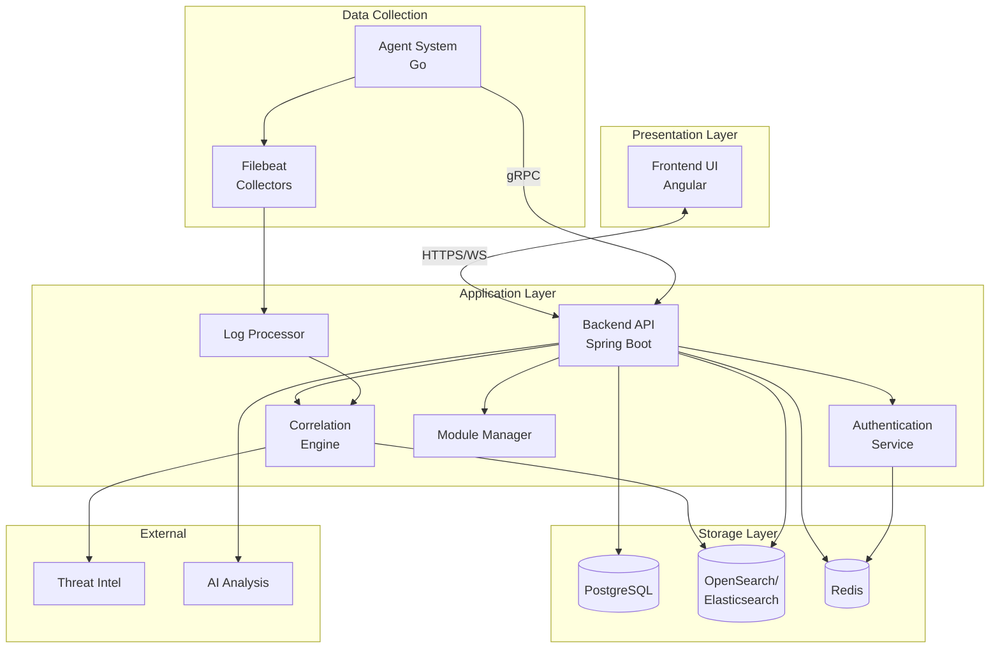

UTMStack is composed of several specialized components that work together to provide comprehensive threat management capabilities. Each component is designed with a specific responsibility and communicates through well-defined interfaces.

## Core Components

### Backend API

The central orchestration layer built with Java and Spring Boot.

**Technology**: Java 17, Spring Boot 3.1.5, JHipster Framework

**Responsibilities**:
- RESTful API services for frontend and integrations
- Business logic and data processing
- Authentication and authorization
- Integration with threat intelligence feeds
- Alert management and incident response
- Compliance reporting and dashboards

**Key Features**:
- JWT-based authentication
- SAML2 integration for SSO
- WebSocket support for real-time updates
- OpenAPI/Swagger documentation
- gRPC server for agent communication

[Learn more →](/architecture/backend-api)

### Frontend UI

The web-based user interface for security analysts and administrators.

**Technology**: Angular 7.2.0, Bootstrap 4, ECharts

**Responsibilities**:
- Interactive dashboards and visualizations
- Log search and analysis interface
- Alert investigation workflows
- Configuration management
- Report generation and export

**Key Features**:
- Real-time data visualization with ECharts
- Customizable dashboards with Gridster2
- Advanced search with query builder
- Multi-language support (i18n)
- Dark/light theme support

[Learn more →](/architecture/frontend-ui)

### Agent System

Lightweight data collection agents deployed on monitored systems.

**Technology**: Go (Golang), gRPC, Protocol Buffers

**Responsibilities**:
- Log collection from multiple sources
- Network traffic monitoring (Netflow, IPFIX)
- System event monitoring
- File integrity monitoring
- Local log buffering and retry

**Key Features**:
- Cross-platform support (Windows, Linux, macOS)
- Low resource footprint
- Secure communication via TLS
- Auto-update capability
- Modular collector architecture

[Learn more →](/architecture/agent-system)

### Correlation Engine

Real-time event correlation and threat detection engine.

**Technology**: Custom-built correlation engine

**Responsibilities**:
- Real-time log correlation before ingestion
- Pattern matching against threat signatures
- Behavioral analysis and anomaly detection
- Alert generation and enrichment
- Threat intelligence integration

**Key Features**:
- Pre-ingestion correlation reduces overhead
- Context-aware threat detection
- Machine learning integration
- Custom correlation rules
- MITRE ATT&CK framework mapping

[Learn more →](/architecture/correlation-engine)

### Data Storage

Multi-tier storage system for different data types.

**Technologies**: PostgreSQL, OpenSearch/Elasticsearch, Redis

**Responsibilities**:
- Structured data storage (PostgreSQL)
- Log data and full-text search (OpenSearch/Elasticsearch)
- Session and cache management (Redis)
- Data retention and archival
- Hot and cold storage management

[Learn more →](/architecture/data-storage)

## Supporting Components

### Log Processor

**Purpose**: Normalize and enrich log data from various sources

**Features**:
- Multi-format parsing (JSON, CEF, LEEF, Syslog)
- Field extraction and normalization
- Timestamp parsing and timezone conversion
- GeoIP enrichment
- Asset correlation

### Module Manager

**Purpose**: Manage integration modules and data collectors

**Features**:
- Enable/disable integrations dynamically
- Configure collector parameters
- Monitor module health
- Update module configurations

### Update Service

**Purpose**: Keep agents and system components up to date

**Features**:
- Automatic update checking
- Secure update distribution
- Rollback capability
- Update scheduling
- Version compatibility checks

### Authentication Service

**Purpose**: Centralized authentication and authorization

**Features**:
- JWT token generation and validation
- SAML2 integration
- Two-factor authentication (2FA)
- Session management
- RBAC enforcement

## Component Diagram

## Component Communication Patterns

### Synchronous Communication
- **HTTP/REST**: Frontend to Backend API calls
- **gRPC**: Agent to Backend communication for commands
- **JDBC**: Backend to PostgreSQL database queries

### Asynchronous Communication
- **WebSocket**: Real-time updates from backend to frontend
- **Message Queue**: Internal event bus for decoupled processing
- **Batch Processing**: Scheduled jobs for reports and maintenance

## Scalability Considerations

Each component is designed to scale independently:

### Stateless Components
- Backend API (can run multiple instances)
- Frontend UI (served via CDN or multiple web servers)
- Log Processor (horizontal scaling)

### Stateful Components
- PostgreSQL (replication for read scaling)
- OpenSearch/Elasticsearch (cluster with multiple nodes)
- Redis (cluster mode for high availability)

## Resource Requirements

### Per Component (Approximate)

| Component | CPU | Memory | Disk | Notes |
|-----------|-----|---------|------|-------|
| Backend API | 2 cores | 4 GB | 20 GB | Scales with concurrent users |
| Frontend UI | 1 core | 2 GB | 10 GB | Static files, minimal resources |
| PostgreSQL | 2 cores | 4 GB | 50 GB | Scales with data retention |
| OpenSearch | 4 cores | 8 GB | 500 GB | Primary storage for logs |
| Agent | 0.5 core | 512 MB | 1 GB | Per agent deployment |
| Correlation Engine | 2 cores | 4 GB | 10 GB | CPU-intensive processing |

## Health Monitoring

All components expose health endpoints and metrics:

- **Backend API**: `/actuator/health` and Prometheus metrics
- **Agents**: gRPC health check service
- **Database**: Connection pool monitoring
- **Search Engine**: Cluster health API

## Next Steps

<CardGroup cols={2}>
  <Card title="Backend API" icon="code" href="/architecture/backend-api">
    Deep dive into the Java/Spring Boot backend
  </Card>
  <Card title="Frontend UI" icon="window" href="/architecture/frontend-ui">
    Explore the Angular frontend application
  </Card>
  <Card title="Agent System" icon="laptop" href="/architecture/agent-system">
    Learn about the Go-based agent system
  </Card>
  <Card title="Data Storage" icon="database" href="/architecture/data-storage">
    Understand the data storage architecture
  </Card>
</CardGroup>