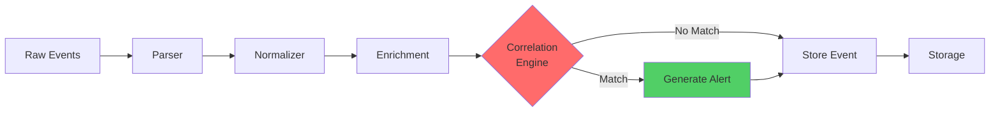
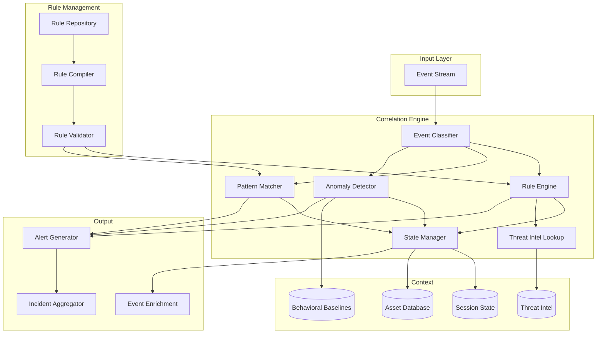

The UTMStack correlation engine is a custom-built, high-performance system that analyzes security events in real-time **before ingestion** into the data store. This approach is a key differentiator that reduces overhead and dramatically improves threat detection speed.

## Overview

Unlike traditional SIEM systems that correlate data after storage, UTMStack correlates events during the ingestion pipeline:



**Benefits**:
- Immediate threat detection (sub-second response)
- Reduced storage requirements (only store relevant data)
- Lower computational overhead
- Real-time alerting without query delays

## Architecture



## Core Components

### 1. Event Classifier

Categorizes incoming events for efficient routing to appropriate correlation rules:

```java
public class EventClassifier {
    private final Map<String, EventCategory> categoryCache;
    private final List<ClassificationRule> rules;
    
    public EventCategory classify(LogEvent event) {
        // Check cache first
        String cacheKey = generateCacheKey(event);
        if (categoryCache.containsKey(cacheKey)) {
            return categoryCache.get(cacheKey);
        }
        
        // Apply classification rules
        for (ClassificationRule rule : rules) {
            if (rule.matches(event)) {
                EventCategory category = rule.getCategory();
                categoryCache.put(cacheKey, category);
                return category;
            }
        }
        
        return EventCategory.UNKNOWN;
    }
}
```

**Event Categories**:
- Authentication events
- Network traffic
- File operations
- Process execution
- Privilege escalation
- Data access
- System changes

### 2. State Manager

Maintains session state and context for stateful correlation:

```java
public class StateManager {
    private final Cache<String, CorrelationState> stateCache;
    private final int defaultTTL = 3600; // 1 hour
    
    public CorrelationState getOrCreateState(String key, int ttl) {
        CorrelationState state = stateCache.getIfPresent(key);
        
        if (state == null) {
            state = new CorrelationState();
            stateCache.put(key, state);
            
            // Schedule cleanup
            scheduleExpiration(key, ttl > 0 ? ttl : defaultTTL);
        }
        
        return state;
    }
    
    public void updateState(String key, Consumer<CorrelationState> updater) {
        CorrelationState state = getOrCreateState(key, defaultTTL);
        synchronized (state) {
            updater.accept(state);
        }
    }
}

public class CorrelationState {
    private Map<String, Object> attributes;
    private List<LogEvent> relatedEvents;
    private Instant firstSeen;
    private Instant lastSeen;
    private int eventCount;
    
    public void addEvent(LogEvent event) {
        relatedEvents.add(event);
        lastSeen = Instant.now();
        eventCount++;
    }
    
    public boolean exceeds(String attribute, int threshold) {
        Integer count = (Integer) attributes.getOrDefault(attribute, 0);
        return count >= threshold;
    }
}
```

### 3. Rule Engine

Executes correlation rules against incoming events:

```java
public interface CorrelationRule {
    String getId();
    String getName();
    String getDescription();
    RuleSeverity getSeverity();
    List<String> getCategories();
    boolean evaluate(LogEvent event, CorrelationContext context);
    Alert generateAlert(LogEvent event, CorrelationContext context);
}

public class RuleEngine {
    private final Map<String, List<CorrelationRule>> rulesByCategory;
    private final StateManager stateManager;
    private final ExecutorService executor;
    
    public List<Alert> evaluateEvent(LogEvent event) {
        List<Alert> alerts = new ArrayList<>();
        EventCategory category = event.getCategory();
        
        // Get applicable rules
        List<CorrelationRule> rules = rulesByCategory.getOrDefault(
            category.getName(), 
            Collections.emptyList()
        );
        
        // Evaluate rules in parallel
        List<Future<Optional<Alert>>> futures = new ArrayList<>();
        
        for (CorrelationRule rule : rules) {
            futures.add(executor.submit(() -> evaluateRule(rule, event)));
        }
        
        // Collect results
        for (Future<Optional<Alert>> future : futures) {
            try {
                future.get(100, TimeUnit.MILLISECONDS).ifPresent(alerts::add);
            } catch (Exception e) {
                log.error("Rule evaluation failed", e);
            }
        }
        
        return alerts;
    }
    
    private Optional<Alert> evaluateRule(CorrelationRule rule, LogEvent event) {
        CorrelationContext context = new CorrelationContext(
            event,
            stateManager,
            assetDatabase,
            threatIntelService
        );
        
        if (rule.evaluate(event, context)) {
            return Optional.of(rule.generateAlert(event, context));
        }
        
        return Optional.empty();
    }
}
```

## Correlation Rule Types

### 1. Simple Threshold Rules

Detect when an event count exceeds a threshold:

```yaml
rule:
  id: "failed-login-threshold"
  name: "Excessive Failed Login Attempts"
  description: "Multiple failed login attempts from single source"
  severity: high
  category: authentication
  
  conditions:
    event_type: "authentication_failure"
    groupby:
      - source_ip
      - username
    threshold: 5
    timewindow: 300s  # 5 minutes
  
  actions:
    - create_alert:
        title: "Brute Force Attack Detected"
        description: "{{threshold}} failed login attempts for user {{username}} from {{source_ip}}"
        severity: high
        mitre_technique: "T1110"  # Brute Force
```

**Implementation**:
```java
public class ThresholdRule implements CorrelationRule {
    private final String eventType;
    private final List<String> groupByFields;
    private final int threshold;
    private final Duration timeWindow;
    
    @Override
    public boolean evaluate(LogEvent event, CorrelationContext context) {
        if (!event.getType().equals(eventType)) {
            return false;
        }
        
        // Generate state key from groupby fields
        String stateKey = generateStateKey(event, groupByFields);
        
        // Update state
        context.getStateManager().updateState(stateKey, state -> {
            state.addEvent(event);
        });
        
        // Check threshold
        CorrelationState state = context.getStateManager().getState(stateKey);
        return state.getEventCount() >= threshold;
    }
}
```

### 2. Sequence Rules

Detect specific event sequences (A followed by B within timeframe):

```yaml
rule:
  id: "privilege-escalation-sequence"
  name: "Privilege Escalation Attempt"
  description: "User gained elevated privileges after failed access"
  severity: critical
  
  sequence:
    - event: "access_denied"
      fields:
        resource_type: "admin_panel"
      alias: "denied"
    
    - event: "privilege_change"
      fields:
        new_privilege: "administrator"
      alias: "escalation"
      where: "escalation.username == denied.username"
      within: 600s
  
  actions:
    - create_alert:
        title: "Suspicious Privilege Escalation"
        severity: critical
        mitre_tactic: "TA0004"  # Privilege Escalation
```

**Implementation**:
```java
public class SequenceRule implements CorrelationRule {
    private final List<SequenceStep> steps;
    
    @Override
    public boolean evaluate(LogEvent event, CorrelationContext context) {
        // Find which step this event matches
        for (int i = 0; i < steps.size(); i++) {
            SequenceStep step = steps.get(i);
            
            if (step.matches(event)) {
                String stateKey = generateSequenceKey(event);
                
                context.getStateManager().updateState(stateKey, state -> {
                    state.recordStep(i, event);
                });
                
                // Check if sequence is complete
                CorrelationState state = context.getStateManager().getState(stateKey);
                if (state.hasCompletedSequence(steps)) {
                    return true;
                }
            }
        }
        
        return false;
    }
}
```

### 3. Anomaly Detection Rules

Detect deviations from learned baselines:

```yaml
rule:
  id: "unusual-data-transfer"
  name: "Unusual Data Transfer Volume"
  description: "Data transfer exceeds normal baseline"
  severity: medium
  
  anomaly:
    metric: "bytes_transferred"
    groupby:
      - username
      - destination
    baseline_period: 7d
    threshold: 3.0  # Standard deviations
    min_samples: 100
  
  actions:
    - create_alert:
        title: "Anomalous Data Transfer"
        description: "User {{username}} transferred {{bytes_transferred}} bytes ({{std_dev}}x normal)"
```

**Implementation**:
```java
public class AnomalyDetectionRule implements CorrelationRule {
    private final BaselineManager baselineManager;
    private final String metric;
    private final double stdDevThreshold;
    
    @Override
    public boolean evaluate(LogEvent event, CorrelationContext context) {
        String baselineKey = generateBaselineKey(event);
        Baseline baseline = baselineManager.getBaseline(baselineKey);
        
        if (baseline == null || !baseline.hasSufficientSamples()) {
            // Learn from this event
            baselineManager.recordSample(baselineKey, getMetricValue(event));
            return false;
        }
        
        double value = getMetricValue(event);
        double zScore = baseline.calculateZScore(value);
        
        if (Math.abs(zScore) >= stdDevThreshold) {
            event.addField("std_dev", String.valueOf(zScore));
            return true;
        }
        
        // Update baseline
        baselineManager.recordSample(baselineKey, value);
        return false;
    }
}

public class Baseline {
    private double mean;
    private double stdDev;
    private int sampleCount;
    private final int minSamples;
    
    public double calculateZScore(double value) {
        if (stdDev == 0) return 0;
        return (value - mean) / stdDev;
    }
    
    public void addSample(double value) {
        // Update running statistics
        sampleCount++;
        double delta = value - mean;
        mean += delta / sampleCount;
        double delta2 = value - mean;
        // ... update variance
    }
}
```

### 4. Threat Intelligence Rules

Match against known threat indicators:

```yaml
rule:
  id: "known-malicious-ip"
  name: "Communication with Known Malicious IP"
  description: "Detected connection to known threat actor IP"
  severity: critical
  
  threat_intel:
    field: "destination_ip"
    indicator_type: "ip"
    min_confidence: 80
    sources:
      - "abuse_ch"
      - "emerging_threats"
      - "alienvault_otx"
  
  actions:
    - create_alert:
        title: "Malicious IP Communication"
        severity: critical
        mitre_tactic: "TA0011"  # Command and Control
```

**Implementation**:
```java
public class ThreatIntelRule implements CorrelationRule {
    private final ThreatIntelligenceService threatIntel;
    private final String fieldName;
    private final int minConfidence;
    
    @Override
    public boolean evaluate(LogEvent event, CorrelationContext context) {
        String value = event.getField(fieldName);
        if (value == null) return false;
        
        ThreatIndicator indicator = threatIntel.lookup(value);
        
        if (indicator != null && indicator.getConfidence() >= minConfidence) {
            // Enrich event with threat intel
            event.addField("threat_type", indicator.getType());
            event.addField("threat_actor", indicator.getActor());
            event.addField("threat_confidence", String.valueOf(indicator.getConfidence()));
            event.addField("threat_sources", String.join(",", indicator.getSources()));
            return true;
        }
        
        return false;
    }
}
```

## MITRE ATT&CK Integration

All correlation rules map to MITRE ATT&CK framework:

```java
public class MitreMapper {
    public void enrichAlert(Alert alert, LogEvent event) {
        List<MitreTechnique> techniques = identifyTechniques(event, alert);
        
        alert.setMitreTactics(techniques.stream()
            .map(MitreTechnique::getTactic)
            .distinct()
            .collect(Collectors.toList()));
        
        alert.setMitreTechniques(techniques.stream()
            .map(t -> new TechniqueReference(
                t.getId(),
                t.getName(),
                t.getUrl()
            ))
            .collect(Collectors.toList()));
    }
}
```

**MITRE Tactics**:
- TA0001: Initial Access
- TA0002: Execution
- TA0003: Persistence
- TA0004: Privilege Escalation
- TA0005: Defense Evasion
- TA0006: Credential Access
- TA0007: Discovery
- TA0008: Lateral Movement
- TA0009: Collection
- TA0010: Exfiltration
- TA0011: Command and Control
- TA0040: Impact

## Performance Optimization

### 1. Rule Indexing

```java
public class RuleIndexer {
    private final Map<String, List<CorrelationRule>> categoryIndex;
    private final Map<String, List<CorrelationRule>> eventTypeIndex;
    private final Map<String, List<CorrelationRule>> severityIndex;
    
    public List<CorrelationRule> getApplicableRules(LogEvent event) {
        Set<CorrelationRule> rules = new HashSet<>();
        
        // Index by category
        rules.addAll(categoryIndex.getOrDefault(
            event.getCategory(), Collections.emptyList()));
        
        // Index by event type
        rules.addAll(eventTypeIndex.getOrDefault(
            event.getType(), Collections.emptyList()));
        
        return new ArrayList<>(rules);
    }
}
```

### 2. Parallel Processing

```java
public class ParallelCorrelationEngine {
    private final ExecutorService executor;
    private final int parallelism;
    
    public List<Alert> correlate(List<LogEvent> events) {
        return events.parallelStream()
            .flatMap(event -> evaluateEvent(event).stream())
            .collect(Collectors.toList());
    }
}
```

### 3. Caching

```java
@Cacheable("threat-intel")
public ThreatIndicator lookupThreat(String indicator) {
    return threatIntelApi.query(indicator);
}

@Cacheable("asset-info")
public Asset getAssetInfo(String ip) {
    return assetDatabase.findByIp(ip);
}
```

## Alert Generation

```java
public class AlertGenerator {
    public Alert createAlert(CorrelationRule rule, LogEvent event, CorrelationContext context) {
        Alert alert = new Alert();
        alert.setId(UUID.randomUUID().toString());
        alert.setName(rule.getName());
        alert.setDescription(renderTemplate(rule.getDescription(), event));
        alert.setSeverity(rule.getSeverity());
        alert.setTimestamp(Instant.now());
        alert.setSource(event.getSource());
        alert.setCategory(rule.getCategory());
        
        // Add related events
        CorrelationState state = context.getState();
        if (state != null) {
            alert.setRelatedEvents(state.getRelatedEvents());
        }
        
        // MITRE ATT&CK mapping
        mitreMapper.enrichAlert(alert, event);
        
        // Threat intelligence
        threatIntelEnricher.enrich(alert, event);
        
        // Asset context
        assetEnricher.enrich(alert, event);
        
        return alert;
    }
}
```

## Next Steps

<CardGroup cols={2}>
  <Card title="Data Flow" icon="diagram-project" href="/architecture/data-flow">
    See how events flow through correlation
  </Card>
  <Card title="Backend API" icon="code" href="/architecture/backend-api">
    Learn how alerts are processed
  </Card>
  <Card title="Performance Tuning" icon="gauge-high" href="/architecture/performance-tuning">
    Optimize correlation performance
  </Card>
  <Card title="High Availability" icon="server" href="/architecture/high-availability">
    Configure correlation for HA
  </Card>
</CardGroup>