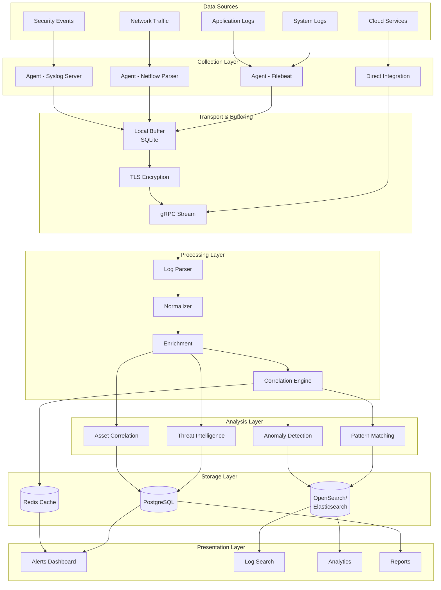

Understanding data flow is critical to comprehending how UTMStack processes security events in real-time. This page explains the journey of data from collection through correlation to storage and presentation.

## Overview

UTMStack processes security data through a pipeline optimized for real-time threat detection. The key innovation is **pre-ingestion correlation**, which analyzes and correlates data before permanent storage, reducing overhead and improving response times.

## Complete Data Flow Diagram



## Detailed Data Flow Stages

### Stage 1: Data Collection

**Purpose**: Gather security events from diverse sources

#### Agent-Based Collection

The UTMStack agent (written in Go) collects data using multiple methods:

**Filebeat Integration**:
- Monitors log files on disk
- Supports multi-line event parsing
- Handles log rotation automatically
- Configurable file patterns

**Network Flow Collection**:
- Listens for Netflow v1, v5, v6, v7, v9
- IPFIX protocol support
- Real-time packet metadata extraction
- Flow aggregation and sampling

**Syslog Server**:
- RFC 3164 and RFC 5424 compliant
- TCP and UDP listeners
- TLS-encrypted syslog (RFC 5425)
- Supports CEF and LEEF formats

**System Events**:
- Windows Event Log collection
- Linux auditd integration
- macOS unified logging
- Process and file monitoring

#### Direct Integrations

**Cloud Services**:
- AWS CloudTrail, VPC Flow Logs, GuardDuty
- Azure Activity Logs, Security Center
- Google Cloud Logging
- Office 365 audit logs

**Security Tools**:
- Firewall logs (Palo Alto, Fortinet, Cisco)
- IDS/IPS (Snort, Suricata)
- EDR platforms
- Email security gateways

### Stage 2: Local Buffering

**Purpose**: Ensure reliable delivery and handle network interruptions

The agent maintains a local SQLite database that:

- Buffers events when the server is unreachable
- Implements retry logic with exponential backoff
- Prevents data loss during network issues
- Manages disk space with automatic cleanup
- Provides local query capability for debugging

**Configuration**:
```go
// Default buffer settings
MaxBufferSize: 1000000 events
RetryInterval: 30 seconds
MaxRetries: 10
BufferRetention: 24 hours
```

### Stage 3: Secure Transport

**Purpose**: Securely transmit events to the UTMStack server

#### gRPC Communication

The agent communicates with the backend using gRPC over TLS:

```protobuf
service AgentService {
  rpc StreamLogs(stream LogBatch) returns (stream LogResponse);
  rpc GetConfiguration(ConfigRequest) returns (ConfigResponse);
  rpc ReportHealth(HealthStatus) returns (HealthResponse);
}
```

**Benefits**:
- Bidirectional streaming for efficient data transfer
- Protocol Buffers for compact serialization
- HTTP/2 multiplexing reduces connection overhead
- Built-in authentication with certificates

#### Authentication

- Each agent uses a unique 24+ character key
- TLS client certificates for mutual authentication
- Key rotation without service interruption
- Centralized key management in backend

### Stage 4: Parsing and Normalization

**Purpose**: Convert diverse log formats into a unified schema

#### Log Parser

Supports multiple formats:
- **JSON**: Native parsing with schema validation
- **Syslog**: RFC-compliant parsing with custom patterns
- **CEF**: Common Event Format from security tools
- **LEEF**: Log Event Extended Format
- **CSV**: Custom delimiter support
- **Key-Value**: Generic key=value parsing

#### Field Normalization

Maps source-specific fields to common schema:

```json
{
  "timestamp": "2026-03-03T10:15:30Z",
  "source_ip": "192.168.1.100",
  "destination_ip": "10.0.0.50",
  "source_port": 54321,
  "destination_port": 443,
  "protocol": "tcp",
  "action": "allow",
  "bytes_sent": 1024,
  "bytes_received": 4096,
  "username": "jsmith",
  "device_type": "firewall",
  "severity": "info"
}
```

### Stage 5: Enrichment

**Purpose**: Add context to events for better analysis

#### GeoIP Enrichment
- IP address to geographic location
- ASN and organization information
- City, country, and region data
- Threat reputation scores

#### Asset Correlation
- Link events to known assets
- User and device information
- Business context (department, criticality)
- Historical behavior baselines

#### Threat Intelligence
- Check IPs against threat feeds
- Domain reputation lookup
- File hash analysis (VirusTotal, etc.)
- MITRE ATT&CK technique mapping

### Stage 6: Real-Time Correlation

**Purpose**: Detect threats by correlating events BEFORE storage

This is UTMStack's key differentiator. The correlation engine:

#### Pattern Matching
- Applies correlation rules in real-time
- Matches against known attack patterns
- Uses stateful analysis (tracks sessions)
- Implements complex event processing

#### Behavioral Analysis
- Compares against learned baselines
- Detects statistical anomalies
- Identifies unusual access patterns
- Recognizes privilege escalation attempts

#### Alert Generation
- Creates alerts for matched rules
- Assigns severity and confidence scores
- Links related events (incident timeline)
- Enriches with context and recommendations

**Example Correlation Rule**:
```yaml
name: "Multiple Failed Login Attempts"
description: "Detect brute force authentication attempts"
conditions:
  - event_type: "authentication_failure"
    groupby: ["source_ip", "username"]
    threshold: 5
    timewindow: 300s
actions:
  - create_alert:
      severity: "high"
      category: "brute_force"
      mitre_tactic: "TA0006"  # Credential Access
```

### Stage 7: Storage

**Purpose**: Persist data for search, analysis, and compliance

#### OpenSearch/Elasticsearch
- **What**: Raw and correlated log events
- **Why**: Fast full-text search and aggregations
- **Retention**: Configurable (default 30 days hot storage)
- **Indexing**: Daily indices with automatic rollover

#### PostgreSQL
- **What**: Alerts, incidents, configuration, users
- **Why**: ACID compliance for critical data
- **Retention**: Long-term (years)
- **Schema**: Relational with foreign keys

#### Redis
- **What**: Session data, real-time counters, cache
- **Why**: In-memory speed for active sessions
- **Retention**: Short-term (hours to days)
- **Persistence**: AOF for durability

### Stage 8: Query and Analysis

**Purpose**: Enable security analysts to investigate and respond

#### Real-Time Dashboards
- WebSocket updates for live data
- ECharts visualizations
- Customizable widgets
- Drill-down capabilities

#### Log Search
- Lucene query syntax
- Field-specific searches
- Time-range filtering
- Export to CSV/JSON

#### Analytics
- Aggregation queries
- Trend analysis
- Comparative analysis
- Statistical functions

## Data Retention Strategy

### Hot Storage (OpenSearch/Elasticsearch)
- Recent data (default 30 days)
- Immediately searchable
- High-performance SSD storage
- Regular indices

### Warm Storage
- Older data (30-90 days)
- Read-only indices
- Compressed for space efficiency
- Slower but still accessible

### Cold Storage
- Archive data (90+ days)
- Snapshot to object storage
- Restore required before search
- Compliance retention

### Retention Configuration

```yaml
data_retention:
  hot_days: 30
  warm_days: 60
  cold_days: 365
  delete_after_days: 2555  # 7 years for compliance
  
index_management:
  rollover:
    max_size: "50gb"
    max_age: "1d"
  compression: true
  replicas: 1
```

## Performance Optimization

### Batching
- Agents batch events (default 100 events or 5 seconds)
- Reduces network overhead
- Improves indexing throughput

### Compression
- gRPC automatic compression
- Reduces bandwidth by 70-80%
- Minimal CPU overhead

### Caching
- Frequently accessed data cached in Redis
- Reduces database load
- Improves dashboard response time

### Indexing Strategy
- Time-based indices for log data
- Index templates for consistency
- Mapping optimization for common fields

## Monitoring Data Flow

Track data flow health with these metrics:

- **Collection Rate**: Events/second per agent
- **Buffer Size**: Events in local buffer
- **Transport Lag**: Delay between collection and ingestion
- **Processing Rate**: Events/second through pipeline
- **Correlation Rate**: Alerts generated/hour
- **Storage Rate**: Data indexed/second
- **Query Performance**: Average search response time

## Next Steps

<CardGroup cols={2}>
  <Card title="Agent System" icon="laptop" href="/architecture/agent-system">
    Learn more about agent-based data collection
  </Card>
  <Card title="Correlation Engine" icon="brain" href="/architecture/correlation-engine">
    Understand real-time correlation
  </Card>
  <Card title="Data Storage" icon="database" href="/architecture/data-storage">
    Deep dive into storage architecture
  </Card>
  <Card title="Performance Tuning" icon="gauge-high" href="/architecture/performance-tuning">
    Optimize data processing performance
  </Card>
</CardGroup>