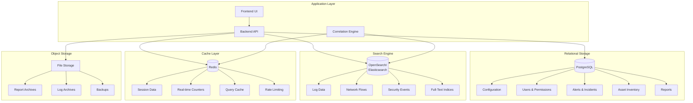

UTMStack uses a multi-tier storage architecture optimized for different data types and access patterns. Each storage system is chosen for its strengths in handling specific workloads.

## Storage Architecture Overview



## PostgreSQL - Relational Data

### Technology

**Database**: PostgreSQL 12+
**Driver**: JDBC with HikariCP connection pooling
**ORM**: Hibernate/JPA
**Migration**: Liquibase

### Schema Design

#### Core Tables

**Users and Authentication**:
```sql
CREATE TABLE utm_user (
    id BIGSERIAL PRIMARY KEY,
    username VARCHAR(100) UNIQUE NOT NULL,
    email VARCHAR(255) UNIQUE NOT NULL,
    password_hash VARCHAR(255) NOT NULL,
    first_name VARCHAR(100),
    last_name VARCHAR(100),
    active BOOLEAN DEFAULT true,
    created_date TIMESTAMP NOT NULL DEFAULT NOW(),
    last_modified_date TIMESTAMP,
    two_factor_secret VARCHAR(255),
    two_factor_enabled BOOLEAN DEFAULT false,
    failed_login_attempts INTEGER DEFAULT 0,
    locked_until TIMESTAMP
);

CREATE TABLE utm_role (
    id BIGSERIAL PRIMARY KEY,
    name VARCHAR(50) UNIQUE NOT NULL,
    description TEXT
);

CREATE TABLE utm_user_role (
    user_id BIGINT REFERENCES utm_user(id),
    role_id BIGINT REFERENCES utm_role(id),
    PRIMARY KEY (user_id, role_id)
);

CREATE INDEX idx_user_username ON utm_user(username);
CREATE INDEX idx_user_email ON utm_user(email);
```

**Alerts and Incidents**:
```sql
CREATE TABLE utm_alert (
    id BIGSERIAL PRIMARY KEY,
    name VARCHAR(255) NOT NULL,
    description TEXT,
    severity VARCHAR(20) NOT NULL,
    status VARCHAR(20) NOT NULL DEFAULT 'OPEN',
    category_id BIGINT REFERENCES utm_alert_category(id),
    source VARCHAR(255),
    source_ip INET,
    destination_ip INET,
    timestamp TIMESTAMP NOT NULL,
    created_date TIMESTAMP NOT NULL DEFAULT NOW(),
    modified_date TIMESTAMP,
    assignee_id BIGINT REFERENCES utm_user(id),
    mitre_tactic VARCHAR(50),
    mitre_technique VARCHAR(50),
    confidence_score INTEGER,
    false_positive BOOLEAN DEFAULT false,
    notes TEXT,
    tags TEXT[]
);

CREATE TABLE utm_alert_event (
    id BIGSERIAL PRIMARY KEY,
    alert_id BIGINT REFERENCES utm_alert(id),
    event_id VARCHAR(255) NOT NULL,
    event_index VARCHAR(100),
    sequence_number INTEGER
);

CREATE TABLE utm_incident (
    id BIGSERIAL PRIMARY KEY,
    title VARCHAR(255) NOT NULL,
    description TEXT,
    severity VARCHAR(20) NOT NULL,
    status VARCHAR(20) NOT NULL DEFAULT 'OPEN',
    created_date TIMESTAMP NOT NULL DEFAULT NOW(),
    resolved_date TIMESTAMP,
    created_by_id BIGINT REFERENCES utm_user(id),
    assigned_to_id BIGINT REFERENCES utm_user(id)
);

CREATE TABLE utm_incident_alert (
    incident_id BIGINT REFERENCES utm_incident(id),
    alert_id BIGINT REFERENCES utm_alert(id),
    PRIMARY KEY (incident_id, alert_id)
);

CREATE INDEX idx_alert_timestamp ON utm_alert(timestamp DESC);
CREATE INDEX idx_alert_status ON utm_alert(status);
CREATE INDEX idx_alert_severity ON utm_alert(severity);
CREATE INDEX idx_alert_source_ip ON utm_alert(source_ip);
```

**Asset Inventory**:
```sql
CREATE TABLE utm_asset (
    id BIGSERIAL PRIMARY KEY,
    hostname VARCHAR(255),
    ip_address INET UNIQUE NOT NULL,
    mac_address MACADDR,
    asset_type VARCHAR(50),
    operating_system VARCHAR(100),
    os_version VARCHAR(50),
    department VARCHAR(100),
    owner VARCHAR(100),
    criticality VARCHAR(20),
    location VARCHAR(255),
    first_seen TIMESTAMP NOT NULL DEFAULT NOW(),
    last_seen TIMESTAMP NOT NULL DEFAULT NOW(),
    active BOOLEAN DEFAULT true,
    tags TEXT[]
);

CREATE INDEX idx_asset_ip ON utm_asset(ip_address);
CREATE INDEX idx_asset_hostname ON utm_asset(hostname);
CREATE INDEX idx_asset_type ON utm_asset(asset_type);
```

**Configuration**:
```sql
CREATE TABLE utm_integration (
    id BIGSERIAL PRIMARY KEY,
    name VARCHAR(100) NOT NULL,
    type VARCHAR(50) NOT NULL,
    enabled BOOLEAN DEFAULT false,
    configuration JSONB NOT NULL,
    credentials_encrypted TEXT,
    created_date TIMESTAMP NOT NULL DEFAULT NOW(),
    last_sync TIMESTAMP
);

CREATE TABLE utm_correlation_rule (
    id BIGSERIAL PRIMARY KEY,
    name VARCHAR(255) NOT NULL,
    description TEXT,
    rule_type VARCHAR(50) NOT NULL,
    enabled BOOLEAN DEFAULT true,
    severity VARCHAR(20) NOT NULL,
    rule_definition JSONB NOT NULL,
    created_date TIMESTAMP NOT NULL DEFAULT NOW(),
    modified_date TIMESTAMP,
    created_by_id BIGINT REFERENCES utm_user(id)
);
```

### Performance Tuning

**Connection Pooling** (from `~/workspace/source/backend/pom.xml`):
```yaml
spring:
  datasource:
    type: com.zaxxer.hikari.HikariDataSource
    url: jdbc:postgresql://localhost:5432/utmstack
    username: utmstack
    hikari:
      poolName: UTMStack-Pool
      maximumPoolSize: 20
      minimumIdle: 5
      connectionTimeout: 30000
      idleTimeout: 600000
      maxLifetime: 1800000
      autoCommit: false
```

**Query Optimization**:
```sql
-- Partial indexes for active records
CREATE INDEX idx_alert_active ON utm_alert(timestamp DESC) 
  WHERE status IN ('OPEN', 'IN_PROGRESS');

-- Covering indexes
CREATE INDEX idx_alert_summary ON utm_alert(id, name, severity, status, timestamp)
  INCLUDE (source_ip, destination_ip);

-- GIN index for array columns
CREATE INDEX idx_alert_tags ON utm_alert USING GIN(tags);

-- BRIN index for time-series data
CREATE INDEX idx_alert_timestamp_brin ON utm_alert USING BRIN(timestamp);
```

**Partitioning for Large Tables**:
```sql
-- Partition alerts by month
CREATE TABLE utm_alert_partitioned (
    LIKE utm_alert INCLUDING ALL
) PARTITION BY RANGE (timestamp);

CREATE TABLE utm_alert_2026_03 PARTITION OF utm_alert_partitioned
    FOR VALUES FROM ('2026-03-01') TO ('2026-04-01');

CREATE TABLE utm_alert_2026_04 PARTITION OF utm_alert_partitioned
    FOR VALUES FROM ('2026-04-01') TO ('2026-05-01');
```

### Backup and Recovery

```bash
# Daily backup
pg_dump -Fc utmstack > /backup/utmstack_$(date +%Y%m%d).dump

# Point-in-time recovery (WAL archiving)
archive_mode = on
archive_command = 'cp %p /archive/%f'
wal_level = replica

# Restore
pg_restore -d utmstack /backup/utmstack_20260303.dump
```

## OpenSearch/Elasticsearch - Log Storage

### Technology

**Search Engine**: Elasticsearch 7.12.1 or OpenSearch 1.x+
**Client**: REST High Level Client (from `pom.xml:221-224`)
**Cluster**: Single-node or multi-node cluster

### Index Strategy

**Time-Based Indices**:
```
logs-2026.03.03
logs-2026.03.04
logs-2026.03.05
...

netflow-2026.03.03
netflow-2026.03.04
```

**Index Templates**:
```json
{
  "index_patterns": ["logs-*"],
  "settings": {
    "number_of_shards": 3,
    "number_of_replicas": 1,
    "index.codec": "best_compression",
    "refresh_interval": "5s",
    "index.max_result_window": 10000
  },
  "mappings": {
    "properties": {
      "@timestamp": {
        "type": "date",
        "format": "strict_date_optional_time||epoch_millis"
      },
      "source_ip": {
        "type": "ip"
      },
      "destination_ip": {
        "type": "ip"
      },
      "source_port": {
        "type": "integer"
      },
      "destination_port": {
        "type": "integer"
      },
      "message": {
        "type": "text",
        "fields": {
          "keyword": {
            "type": "keyword",
            "ignore_above": 256
          }
        }
      },
      "severity": {
        "type": "keyword"
      },
      "event_type": {
        "type": "keyword"
      },
      "user": {
        "type": "keyword"
      },
      "hostname": {
        "type": "keyword"
      },
      "tags": {
        "type": "keyword"
      },
      "geo": {
        "properties": {
          "location": {
            "type": "geo_point"
          },
          "country": {
            "type": "keyword"
          },
          "city": {
            "type": "keyword"
          }
        }
      }
    }
  }
}
```

### Index Lifecycle Management (ILM)

```json
{
  "policy": {
    "phases": {
      "hot": {
        "min_age": "0ms",
        "actions": {
          "rollover": {
            "max_size": "50gb",
            "max_age": "1d"
          },
          "set_priority": {
            "priority": 100
          }
        }
      },
      "warm": {
        "min_age": "30d",
        "actions": {
          "forcemerge": {
            "max_num_segments": 1
          },
          "shrink": {
            "number_of_shards": 1
          },
          "set_priority": {
            "priority": 50
          }
        }
      },
      "cold": {
        "min_age": "90d",
        "actions": {
          "freeze": {},
          "set_priority": {
            "priority": 0
          }
        }
      },
      "delete": {
        "min_age": "365d",
        "actions": {
          "delete": {}
        }
      }
    }
  }
}
```

### Search Optimization

**Java Client Usage**:
```java
@Service
public class LogSearchService {
    private final RestHighLevelClient client;
    
    public SearchResult search(LogSearchRequest request) throws IOException {
        SearchSourceBuilder sourceBuilder = new SearchSourceBuilder();
        
        // Build query
        BoolQueryBuilder query = QueryBuilders.boolQuery();
        
        // User query string
        if (StringUtils.isNotBlank(request.getQuery())) {
            query.must(QueryBuilders.queryStringQuery(request.getQuery())
                .defaultField("message")
                .allowLeadingWildcard(false)
            );
        }
        
        // Time range
        query.filter(QueryBuilders.rangeQuery("@timestamp")
            .gte(request.getStartTime())
            .lte(request.getEndTime())
            .format("strict_date_optional_time")
        );
        
        // Filters
        if (request.getSeverity() != null) {
            query.filter(QueryBuilders.termsQuery("severity", request.getSeverity()));
        }
        
        sourceBuilder.query(query)
            .from(request.getOffset())
            .size(request.getLimit())
            .sort("@timestamp", SortOrder.DESC)
            .timeout(TimeValue.timeValueSeconds(30));
        
        // Highlighting
        sourceBuilder.highlighter(new HighlightBuilder()
            .field("message")
            .preTags("<mark>")
            .postTags("</mark>")
        );
        
        // Execute search
        SearchRequest searchRequest = new SearchRequest("logs-*")
            .source(sourceBuilder);
        
        SearchResponse response = client.search(searchRequest, RequestOptions.DEFAULT);
        
        return convertToSearchResult(response);
    }
}
```

**Aggregations**:
```java
public Map<String, Long> getTopSources(String timeRange) throws IOException {
    SearchSourceBuilder sourceBuilder = new SearchSourceBuilder()
        .size(0) // Don't need documents
        .query(QueryBuilders.rangeQuery("@timestamp").gte(timeRange))
        .aggregation(AggregationBuilders.terms("top_sources")
            .field("source_ip")
            .size(10)
        );
    
    SearchRequest request = new SearchRequest("logs-*").source(sourceBuilder);
    SearchResponse response = client.search(request, RequestOptions.DEFAULT);
    
    Terms agg = response.getAggregations().get("top_sources");
    return agg.getBuckets().stream()
        .collect(Collectors.toMap(
            bucket -> bucket.getKeyAsString(),
            bucket -> bucket.getDocCount()
        ));
}
```

### Cluster Configuration

**Single-Node** (for small deployments):
```yaml
cluster.name: utmstack
node.name: utmstack-node-1
node.master: true
node.data: true
path.data: /var/lib/elasticsearch
path.logs: /var/log/elasticsearch
network.host: 0.0.0.0
http.port: 9200
discovery.type: single-node
```

**Multi-Node Cluster** (for horizontal scaling):
```yaml
cluster.name: utmstack
node.name: utmstack-node-1
node.master: true
node.data: true
path.data: /var/lib/elasticsearch
path.logs: /var/log/elasticsearch
network.host: 0.0.0.0
http.port: 9200
discovery.seed_hosts: ["node1:9300", "node2:9300", "node3:9300"]
cluster.initial_master_nodes: ["utmstack-node-1", "utmstack-node-2", "utmstack-node-3"]
```

## Redis - Cache and Session Storage

### Technology

**Cache**: Redis 6+
**Client**: Spring Data Redis with Lettuce
**Persistence**: AOF (Append-Only File)

### Use Cases

#### 1. Session Management

```java
@Configuration
@EnableRedisHttpSession(maxInactiveIntervalInSeconds = 3600)
public class RedisSessionConfig {
    @Bean
    public LettuceConnectionFactory connectionFactory() {
        return new LettuceConnectionFactory(
            new RedisStandaloneConfiguration("localhost", 6379)
        );
    }
}
```

#### 2. Query Result Caching

```java
@Service
public class DashboardService {
    @Cacheable(value = "dashboard-widgets", key = "#userId", unless = "#result == null")
    public List<Widget> getUserWidgets(Long userId) {
        return widgetRepository.findByUserId(userId);
    }
    
    @CacheEvict(value = "dashboard-widgets", key = "#userId")
    public void updateWidget(Long userId, Widget widget) {
        widgetRepository.save(widget);
    }
}
```

#### 3. Real-Time Counters

```java
@Service
public class MetricsService {
    private final RedisTemplate<String, String> redisTemplate;
    
    public void incrementAlertCount(String severity) {
        String key = "metrics:alerts:" + severity + ":" + LocalDate.now();
        redisTemplate.opsForValue().increment(key);
        redisTemplate.expire(key, Duration.ofDays(7));
    }
    
    public Map<String, Long> getAlertCountsBySeverity() {
        String pattern = "metrics:alerts:*:" + LocalDate.now();
        Set<String> keys = redisTemplate.keys(pattern);
        
        return keys.stream()
            .collect(Collectors.toMap(
                key -> key.split(":")[2],
                key -> Long.parseLong(redisTemplate.opsForValue().get(key))
            ));
    }
}
```

#### 4. Rate Limiting

```java
@Service
public class RateLimitService {
    private final RedisTemplate<String, String> redisTemplate;
    
    public boolean allowRequest(String userId, int maxRequests, Duration window) {
        String key = "rate_limit:" + userId;
        Long count = redisTemplate.opsForValue().increment(key);
        
        if (count == 1) {
            redisTemplate.expire(key, window);
        }
        
        return count <= maxRequests;
    }
}
```

### Configuration

```yaml
spring:
  redis:
    host: localhost
    port: 6379
    password: ${REDIS_PASSWORD}
    database: 0
    lettuce:
      pool:
        max-active: 20
        max-idle: 10
        min-idle: 5
        max-wait: 1000ms
    timeout: 3000ms
```

**Redis Server Configuration**:
```conf
# Memory
maxmemory 2gb
maxmemory-policy allkeys-lru

# Persistence
appendonly yes
appendfilename "appendonly.aof"
appendfsync everysec

# Security
requirepass ${REDIS_PASSWORD}

# Performance
tcp-backlog 511
timeout 300
tcp-keepalive 300
```

## Storage Capacity Planning

### Calculation Examples

**Log Data** (OpenSearch/Elasticsearch):
```
Average event size: 2 KB
Events per day: 10 million
Daily storage: 10M × 2 KB = 20 GB
With compression (70%): 20 GB × 0.3 = 6 GB/day
With replication (1 replica): 6 GB × 2 = 12 GB/day

30-day retention: 12 GB × 30 = 360 GB
90-day retention: 12 GB × 90 = 1.08 TB
```

**Alert Data** (PostgreSQL):
```
Alerts per day: 1000
Average size per alert: 5 KB
Daily storage: 1000 × 5 KB = 5 MB

1-year retention: 5 MB × 365 = 1.8 GB
```

### Resource Requirements by Scale

| Data Sources | Log Volume/Day | PostgreSQL | Elasticsearch | Redis | Total Storage |
|--------------|----------------|------------|---------------|-------|---------------|
| 50 | 100 GB | 20 GB | 150 GB (30d) | 4 GB | 174 GB |
| 120 | 250 GB | 30 GB | 375 GB (30d) | 8 GB | 413 GB |
| 240 | 500 GB | 50 GB | 750 GB (30d) | 16 GB | 816 GB |
| 500 | 1 TB | 100 GB | 1.5 TB (30d) | 32 GB | 1.63 TB |

## Backup Strategy

### PostgreSQL
```bash
#!/bin/bash
# Daily backup
DATE=$(date +%Y%m%d)
pg_dump -Fc utmstack > /backup/postgres/utmstack_${DATE}.dump

# Keep last 7 days
find /backup/postgres -name "utmstack_*.dump" -mtime +7 -delete
```

### Elasticsearch/OpenSearch
```bash
# Snapshot repository setup
PUT /_snapshot/backup_repository
{
  "type": "fs",
  "settings": {
    "location": "/mnt/backup/elasticsearch",
    "compress": true
  }
}

# Create snapshot
PUT /_snapshot/backup_repository/snapshot_20260303
{
  "indices": "logs-*,netflow-*",
  "ignore_unavailable": true,
  "include_global_state": false
}
```

### Redis
```bash
# AOF persistence provides point-in-time recovery
# Copy AOF file for backup
cp /var/lib/redis/appendonly.aof /backup/redis/appendonly_$(date +%Y%m%d).aof
```

## Next Steps

<CardGroup cols={2}>
  <Card title="Data Flow" icon="diagram-project" href="/architecture/data-flow">
    Understand how data flows into storage
  </Card>
  <Card title="Backend API" icon="code" href="/architecture/backend-api">
    Learn how the API accesses storage
  </Card>
  <Card title="Performance Tuning" icon="gauge-high" href="/architecture/performance-tuning">
    Optimize storage performance
  </Card>
  <Card title="Horizontal Scaling" icon="arrows-left-right" href="/architecture/horizontal-scaling">
    Scale storage for large deployments
  </Card>
</CardGroup>