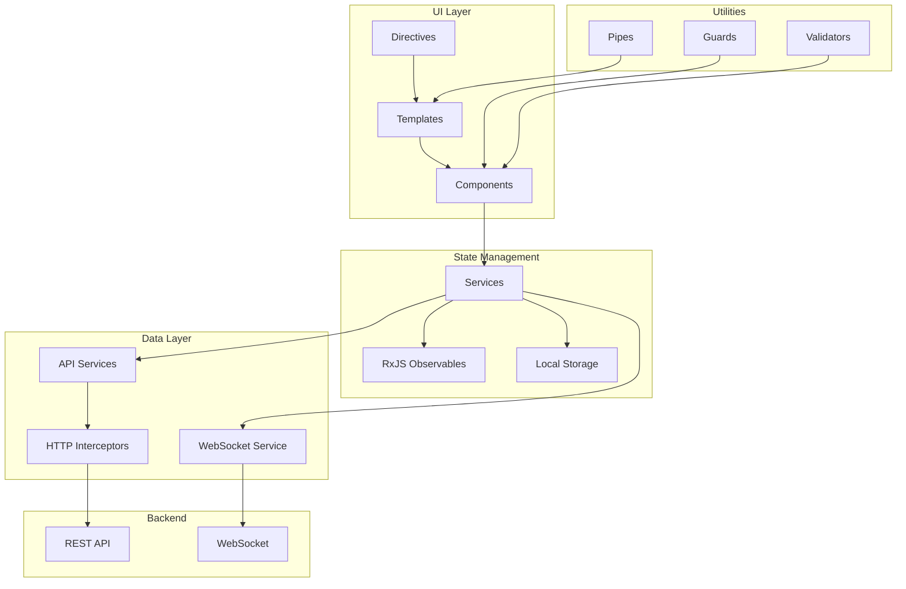

The UTMStack frontend is a sophisticated single-page application (SPA) built with Angular 7.2.0. It provides security analysts and administrators with an intuitive interface for threat detection, investigation, and response.

## Technology Stack

### Core Framework
- **Angular**: 7.2.0
- **TypeScript**: 3.2.2
- **RxJS**: 6.3.3 (reactive programming)
- **Angular CLI**: 7.3.6

### UI Components & Styling
- **Bootstrap**: 4.3.1 (responsive layout)
- **ng-bootstrap**: 4.1.0 (Bootstrap components for Angular)
- **Font Awesome**: 4.7.0 (icons)
- **Animate.css**: 3.7.0 (animations)
- **Magic Check**: 1.0.3 (custom checkboxes/radios)

### Data Visualization
```json
{
  "echarts": "4.4.0",
  "echarts-gl": "1.1.1",
  "echarts-leaflet": "1.1.0",
  "echarts-stat": "1.1.1",
  "echarts-wordcloud": "1.1.3",
  "ngx-echarts": "4.1.1",
  "leaflet": "1.6.0",
  "leaflet.heat": "0.2.0"
}
```

### Additional Features
- **Monaco Editor**: 0.20.0 (code editor for queries)
- **ngx-json-viewer**: 2.4.0 (JSON visualization)
- **moment**: 2.29.4 (date/time handling)
- **html2canvas**: 1.0.0-rc.1 (screenshot capture)
- **jsPDF**: 2.3.1 (PDF generation)

## Application Architecture



## Key Features

### 1. Interactive Dashboards

**Dashboard Grid System**:
```typescript
import { GridsterConfig, GridsterItem } from 'angular-gridster2';

export class DashboardComponent implements OnInit {
  options: GridsterConfig;
  dashboard: Array<GridsterItem>;
  
  ngOnInit() {
    this.options = {
      gridType: GridType.Fit,
      displayGrid: DisplayGrid.OnDragAndResize,
      pushItems: true,
      draggable: {
        enabled: true
      },
      resizable: {
        enabled: true
      }
    };
    
    this.loadDashboardWidgets();
  }
  
  loadDashboardWidgets() {
    this.dashboardService.getUserDashboard().subscribe(
      (dashboard) => {
        this.dashboard = dashboard.widgets.map(widget => ({
          x: widget.x,
          y: widget.y,
          cols: widget.cols,
          rows: widget.rows,
          type: widget.type,
          config: widget.config
        }));
      }
    );
  }
}
```

**ECharts Visualization**:
```typescript
import { EChartOption } from 'echarts';

export class AlertTrendWidget implements OnInit {
  chartOption: EChartOption;
  
  ngOnInit() {
    this.loadAlertTrends();
  }
  
  loadAlertTrends() {
    this.alertService.getAlertTrends('24h').subscribe(
      (data) => {
        this.chartOption = {
          title: { text: 'Alert Trends - Last 24 Hours' },
          tooltip: { trigger: 'axis' },
          xAxis: {
            type: 'category',
            data: data.timestamps
          },
          yAxis: {
            type: 'value'
          },
          series: [{
            name: 'High Severity',
            type: 'line',
            data: data.highSeverity,
            itemStyle: { color: '#d32f2f' }
          }, {
            name: 'Medium Severity',
            type: 'line',
            data: data.mediumSeverity,
            itemStyle: { color: '#f57c00' }
          }, {
            name: 'Low Severity',
            type: 'line',
            data: data.lowSeverity,
            itemStyle: { color: '#fbc02d' }
          }]
        };
      }
    );
  }
}
```

### 2. Advanced Log Search

**Search Component**:
```typescript
export class LogSearchComponent implements OnInit {
  searchForm: FormGroup;
  searchResults: LogEvent[] = [];
  loading = false;
  
  constructor(
    private fb: FormBuilder,
    private logService: LogSearchService
  ) {}
  
  ngOnInit() {
    this.searchForm = this.fb.group({
      query: [''],
      timeRange: ['last_24h'],
      startTime: [null],
      endTime: [null],
      sources: [[]],
      severity: [[]]
    });
  }
  
  search() {
    this.loading = true;
    const request = this.buildSearchRequest();
    
    this.logService.search(request).subscribe(
      (results) => {
        this.searchResults = results.events;
        this.loading = false;
      },
      (error) => {
        this.toastr.error('Search failed', 'Error');
        this.loading = false;
      }
    );
  }
  
  buildSearchRequest(): LogSearchRequest {
    const formValue = this.searchForm.value;
    return {
      query: formValue.query,
      startTime: this.calculateStartTime(formValue.timeRange),
      endTime: new Date().toISOString(),
      filters: {
        sources: formValue.sources,
        severity: formValue.severity
      },
      offset: 0,
      limit: 100
    };
  }
}
```

**Monaco Editor Integration**:
```typescript
import { Component } from '@angular/core';

@Component({
  selector: 'app-query-editor',
  template: `
    <ngx-monaco-editor
      [options]="editorOptions"
      [(ngModel)]="query"
      (ngModelChange)="onQueryChange($event)">
    </ngx-monaco-editor>
  `
})
export class QueryEditorComponent {
  query = '';
  
  editorOptions = {
    theme: 'vs-dark',
    language: 'lucene',
    minimap: { enabled: false },
    automaticLayout: true,
    suggest: {
      showFields: true,
      showKeywords: true
    }
  };
  
  onQueryChange(query: string) {
    // Validate and emit query
    this.queryChange.emit(query);
  }
}
```

### 3. Real-Time Alert Updates

**WebSocket Service**:
```typescript
import { Injectable } from '@angular/core';
import * as SockJS from 'sockjs-client';
import * as Stomp from 'stompjs';
import { Observable, Subject } from 'rxjs';

@Injectable({ providedIn: 'root' })
export class WebSocketService {
  private stompClient: any;
  private alertSubject = new Subject<Alert>();
  
  connect(): void {
    const socket = new SockJS('/websocket');
    this.stompClient = Stomp.over(socket);
    
    this.stompClient.connect({}, () => {
      this.stompClient.subscribe('/topic/alerts', (message) => {
        const alert = JSON.parse(message.body);
        this.alertSubject.next(alert);
      });
    });
  }
  
  getAlertStream(): Observable<Alert> {
    return this.alertSubject.asObservable();
  }
  
  disconnect(): void {
    if (this.stompClient) {
      this.stompClient.disconnect();
    }
  }
}
```

**Alert Dashboard Component**:
```typescript
export class AlertDashboardComponent implements OnInit, OnDestroy {
  alerts: Alert[] = [];
  private subscription: Subscription;
  
  constructor(
    private websocketService: WebSocketService,
    private toastr: ToastrService
  ) {}
  
  ngOnInit() {
    this.loadInitialAlerts();
    this.subscribeToAlerts();
  }
  
  subscribeToAlerts() {
    this.websocketService.connect();
    
    this.subscription = this.websocketService.getAlertStream().subscribe(
      (alert) => {
        this.alerts.unshift(alert);
        this.showAlertNotification(alert);
      }
    );
  }
  
  showAlertNotification(alert: Alert) {
    this.toastr.warning(
      alert.description,
      `New ${alert.severity} Alert`,
      {
        timeOut: 5000,
        progressBar: true,
        closeButton: true
      }
    );
  }
  
  ngOnDestroy() {
    this.subscription?.unsubscribe();
    this.websocketService.disconnect();
  }
}
```

### 4. Geographic Visualization

**Leaflet Map Integration**:
```typescript
import * as L from 'leaflet';
import 'leaflet.heat';

export class ThreatMapComponent implements OnInit {
  private map: L.Map;
  private heatLayer: any;
  
  ngOnInit() {
    this.initializeMap();
    this.loadThreatData();
  }
  
  initializeMap() {
    this.map = L.map('threat-map').setView([20, 0], 2);
    
    L.tileLayer('https://{s}.tile.openstreetmap.org/{z}/{x}/{y}.png', {
      attribution: '© OpenStreetMap contributors'
    }).addTo(this.map);
  }
  
  loadThreatData() {
    this.threatService.getThreatLocations().subscribe(
      (threats) => {
        const heatData = threats.map(t => [
          t.latitude,
          t.longitude,
          t.severity // Intensity
        ]);
        
        if (this.heatLayer) {
          this.map.removeLayer(this.heatLayer);
        }
        
        this.heatLayer = (L as any).heatLayer(heatData, {
          radius: 25,
          blur: 15,
          maxZoom: 10,
          gradient: {
            0.0: 'green',
            0.5: 'yellow',
            1.0: 'red'
          }
        }).addTo(this.map);
      }
    );
  }
}
```

## State Management

### Service-Based State

```typescript
import { Injectable } from '@angular/core';
import { BehaviorSubject, Observable } from 'rxjs';

@Injectable({ providedIn: 'root' })
export class UserPreferencesService {
  private preferencesSubject = new BehaviorSubject<UserPreferences>(null);
  public preferences$ = this.preferencesSubject.asObservable();
  
  loadPreferences(): void {
    const stored = localStorage.getItem('userPreferences');
    if (stored) {
      this.preferencesSubject.next(JSON.parse(stored));
    } else {
      this.loadFromServer();
    }
  }
  
  updatePreferences(preferences: Partial<UserPreferences>): void {
    const current = this.preferencesSubject.value;
    const updated = { ...current, ...preferences };
    
    localStorage.setItem('userPreferences', JSON.stringify(updated));
    this.preferencesSubject.next(updated);
    
    // Sync with server
    this.api.updatePreferences(updated).subscribe();
  }
  
  private loadFromServer(): void {
    this.api.getPreferences().subscribe(
      (preferences) => {
        this.preferencesSubject.next(preferences);
        localStorage.setItem('userPreferences', JSON.stringify(preferences));
      }
    );
  }
}
```

## Authentication & Security

### Auth Guard

```typescript
import { Injectable } from '@angular/core';
import { CanActivate, Router, ActivatedRouteSnapshot } from '@angular/router';
import { AuthService } from './auth.service';

@Injectable({ providedIn: 'root' })
export class AuthGuard implements CanActivate {
  constructor(
    private authService: AuthService,
    private router: Router
  ) {}
  
  canActivate(route: ActivatedRouteSnapshot): boolean {
    if (!this.authService.isAuthenticated()) {
      this.router.navigate(['/login']);
      return false;
    }
    
    const requiredRoles = route.data.roles as string[];
    if (requiredRoles && !this.authService.hasAnyRole(requiredRoles)) {
      this.router.navigate(['/forbidden']);
      return false;
    }
    
    return true;
  }
}
```

### HTTP Interceptor

```typescript
import { Injectable } from '@angular/core';
import { HttpInterceptor, HttpRequest, HttpHandler, HttpEvent } from '@angular/common/http';
import { Observable } from 'rxjs';
import { AuthService } from './auth.service';

@Injectable()
export class AuthInterceptor implements HttpInterceptor {
  constructor(private authService: AuthService) {}
  
  intercept(req: HttpRequest<any>, next: HttpHandler): Observable<HttpEvent<any>> {
    const token = this.authService.getToken();
    
    if (token) {
      const cloned = req.clone({
        headers: req.headers.set('Authorization', `Bearer ${token}`)
      });
      return next.handle(cloned);
    }
    
    return next.handle(req);
  }
}
```

## Responsive Design

### Mobile-First Approach

```scss
// Mobile first
.dashboard-grid {
  display: grid;
  grid-template-columns: 1fr;
  gap: 1rem;
  
  // Tablet
  @media (min-width: 768px) {
    grid-template-columns: repeat(2, 1fr);
  }
  
  // Desktop
  @media (min-width: 1200px) {
    grid-template-columns: repeat(3, 1fr);
  }
}

// Alert card
.alert-card {
  padding: 1rem;
  border-radius: 4px;
  box-shadow: 0 2px 4px rgba(0,0,0,0.1);
  
  &.severity-high {
    border-left: 4px solid #d32f2f;
  }
  
  &.severity-medium {
    border-left: 4px solid #f57c00;
  }
  
  &.severity-low {
    border-left: 4px solid #fbc02d;
  }
}
```

## Performance Optimization

### Lazy Loading Modules

```typescript
const routes: Routes = [
  {
    path: 'dashboards',
    loadChildren: () => import('./dashboards/dashboards.module')
      .then(m => m.DashboardsModule),
    canActivate: [AuthGuard]
  },
  {
    path: 'alerts',
    loadChildren: () => import('./alerts/alerts.module')
      .then(m => m.AlertsModule),
    canActivate: [AuthGuard]
  },
  {
    path: 'logs',
    loadChildren: () => import('./logs/logs.module')
      .then(m => m.LogsModule),
    canActivate: [AuthGuard],
    data: { roles: ['ROLE_ANALYST', 'ROLE_ADMIN'] }
  }
];
```

### OnPush Change Detection

```typescript
import { Component, ChangeDetectionStrategy, Input } from '@angular/core';

@Component({
  selector: 'app-alert-card',
  templateUrl: './alert-card.component.html',
  changeDetection: ChangeDetectionStrategy.OnPush
})
export class AlertCardComponent {
  @Input() alert: Alert;
  
  // Component only updates when input reference changes
}
```

### Virtual Scrolling

```typescript
import { Component } from '@angular/core';
import { ScrollingModule } from '@angular/cdk/scrolling';

@Component({
  selector: 'app-log-list',
  template: `
    <cdk-virtual-scroll-viewport itemSize="50" class="log-viewport">
      <div *cdkVirtualFor="let log of logs" class="log-item">
        {{ log.timestamp }} - {{ log.message }}
      </div>
    </cdk-virtual-scroll-viewport>
  `
})
export class LogListComponent {
  logs: LogEvent[] = [];
}
```

## Internationalization

```typescript
import { TranslateService } from '@ngx-translate/core';

export class AppComponent implements OnInit {
  constructor(private translate: TranslateService) {
    translate.setDefaultLang('en');
    translate.use(localStorage.getItem('language') || 'en');
  }
  
  switchLanguage(lang: string) {
    this.translate.use(lang);
    localStorage.setItem('language', lang);
  }
}
```

## Next Steps

<CardGroup cols={2}>
  <Card title="Backend API" icon="code" href="/architecture/backend-api">
    Understand the API consumed by the frontend
  </Card>
  <Card title="Agent System" icon="laptop" href="/architecture/agent-system">
    Learn about data collection agents
  </Card>
  <Card title="Data Flow" icon="diagram-project" href="/architecture/data-flow">
    See how data flows to the UI
  </Card>
  <Card title="System Architecture" icon="sitemap" href="/architecture/system-architecture">
    View the complete system design
  </Card>
</CardGroup>