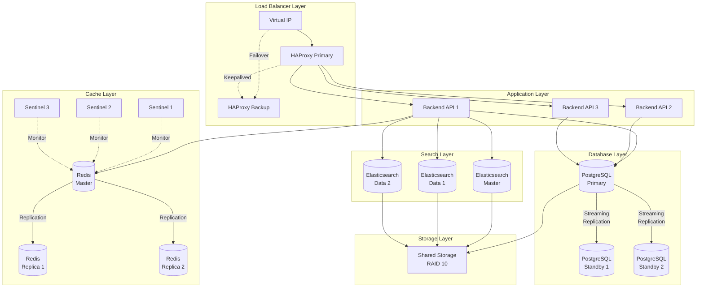

High availability (HA) ensures that UTMStack continues to operate even when individual components fail. This guide covers redundancy, failover, and disaster recovery strategies.

## High Availability Overview

### Availability Targets

| Tier | Uptime % | Downtime/Year | Configuration |
|------|----------|---------------|---------------|
| Standard | 99.0% | 3.65 days | Single node with backups |
| High | 99.9% | 8.76 hours | Multi-node with replication |
| Very High | 99.99% | 52.56 minutes | Full HA cluster with redundancy |
| Mission Critical | 99.999% | 5.26 minutes | Geo-redundant, active-active |

### Failure Scenarios

**Component Failures**:
- Backend API server crash
- Database server failure
- Elasticsearch node failure
- Network connectivity loss
- Disk failure
- Agent communication loss

**Recovery Objectives**:
- **RTO (Recovery Time Objective)**: How quickly service is restored
- **RPO (Recovery Point Objective)**: How much data loss is acceptable

Typical targets:
- RTO: < 5 minutes
- RPO: < 1 minute

## High Availability Architecture



## Load Balancer Configuration

### HAProxy with Keepalived

**HAProxy Configuration** (`/etc/haproxy/haproxy.cfg`):
```conf
global
    log /dev/log local0
    log /dev/log local1 notice
    chroot /var/lib/haproxy
    stats socket /run/haproxy/admin.sock mode 660 level admin
    stats timeout 30s
    user haproxy
    group haproxy
    daemon
    
    # SSL
    ssl-default-bind-ciphers ECDHE-ECDSA-AES128-GCM-SHA256:ECDHE-RSA-AES128-GCM-SHA256
    ssl-default-bind-options ssl-min-ver TLSv1.2

defaults
    log     global
    mode    http
    option  httplog
    option  dontlognull
    option  http-server-close
    option  forwardfor except 127.0.0.0/8
    option  redispatch
    retries 3
    timeout connect 5000
    timeout client  50000
    timeout server  50000

# Stats page
listen stats
    bind *:8404
    stats enable
    stats uri /stats
    stats refresh 30s
    stats admin if TRUE

# Frontend for HTTPS
frontend https_frontend
    bind *:443 ssl crt /etc/ssl/utmstack.pem
    
    # Security headers
    http-response set-header Strict-Transport-Security "max-age=31536000; includeSubDomains"
    http-response set-header X-Frame-Options "SAMEORIGIN"
    http-response set-header X-Content-Type-Options "nosniff"
    
    # ACLs
    acl is_api path_beg /api
    acl is_websocket path_beg /websocket
    
    # Routing
    use_backend api_backend if is_api
    use_backend websocket_backend if is_websocket
    default_backend web_backend

# Backend API servers
backend api_backend
    balance leastconn
    option httpchk GET /actuator/health
    http-check expect status 200
    
    server app1 10.0.1.11:8080 check inter 5000 fall 3 rise 2
    server app2 10.0.1.12:8080 check inter 5000 fall 3 rise 2
    server app3 10.0.1.13:8080 check inter 5000 fall 3 rise 2 backup

# WebSocket backend
backend websocket_backend
    balance leastconn
    option http-server-close
    option forceclose
    
    server app1 10.0.1.11:8080 check
    server app2 10.0.1.12:8080 check

# Frontend web servers
backend web_backend
    balance roundrobin
    
    server web1 10.0.1.21:80 check
    server web2 10.0.1.22:80 check

# gRPC backend for agents
frontend grpc_frontend
    bind *:50051
    mode tcp
    default_backend grpc_backend

backend grpc_backend
    mode tcp
    balance leastconn
    option tcp-check
    
    server app1 10.0.1.11:50051 check
    server app2 10.0.1.12:50051 check
    server app3 10.0.1.13:50051 check
```

**Keepalived Configuration** (Primary - `/etc/keepalived/keepalived.conf`):
```conf
vrrp_script check_haproxy {
    script "/usr/bin/killall -0 haproxy"
    interval 2
    weight 2
}

vrrp_instance VI_1 {
    state MASTER
    interface eth0
    virtual_router_id 51
    priority 100
    advert_int 1
    
    authentication {
        auth_type PASS
        auth_pass ${VRRP_PASSWORD}
    }
    
    virtual_ipaddress {
        10.0.1.100/24
    }
    
    track_script {
        check_haproxy
    }
    
    notify_master "/etc/keepalived/notify_master.sh"
    notify_backup "/etc/keepalived/notify_backup.sh"
    notify_fault "/etc/keepalived/notify_fault.sh"
}
```

**Keepalived Configuration** (Backup):
```conf
vrrp_instance VI_1 {
    state BACKUP
    interface eth0
    virtual_router_id 51
    priority 99  # Lower than primary
    # ... rest same as primary
}
```

## Database High Availability

### PostgreSQL Streaming Replication

**Primary Server Configuration** (`postgresql.conf`):
```conf
# Replication
listen_addresses = '*'
wal_level = replica
max_wal_senders = 10
max_replication_slots = 10
wal_keep_size = 1GB
archive_mode = on
archive_command = 'rsync -a %p /archive/%f'

# Synchronous replication (optional, for zero data loss)
synchronous_commit = on
synchronous_standby_names = 'standby1,standby2'
```

**Primary Server** (`pg_hba.conf`):
```conf
# Replication connections
host replication replicator 10.0.1.0/24 md5
```

**Standby Server Configuration** (`postgresql.conf`):
```conf
hot_standby = on
max_standby_streaming_delay = 30s
wal_receiver_status_interval = 10s
hot_standby_feedback = on
```

**Standby Server** (`standby.signal` file):
```conf
primary_conninfo = 'host=10.0.1.11 port=5432 user=replicator password=${REPLICATION_PASSWORD} application_name=standby1'
primary_slot_name = 'standby1'
restore_command = 'cp /archive/%f %p'
```

**Setup Replication**:
```bash
# On standby server
sudo systemctl stop postgresql
sudo rm -rf /var/lib/postgresql/14/main/*
sudo -u postgres pg_basebackup -h 10.0.1.11 -D /var/lib/postgresql/14/main -U replicator -P -v -R -X stream -C -S standby1
sudo systemctl start postgresql
```

**Monitor Replication**:
```sql
-- On primary
SELECT 
    client_addr,
    application_name,
    state,
    sync_state,
    pg_wal_lsn_diff(pg_current_wal_lsn(), sent_lsn) AS send_lag,
    pg_wal_lsn_diff(pg_current_wal_lsn(), replay_lsn) AS replay_lag
FROM pg_stat_replication;

-- On standby
SELECT pg_is_in_recovery();
SELECT pg_last_wal_receive_lsn();
SELECT pg_last_wal_replay_lsn();
```

### Automatic Failover with Patroni

**Patroni Configuration** (`/etc/patroni/patroni.yml`):
```yaml
scope: utmstack-cluster
namespace: /service/
name: postgresql1

restapi:
  listen: 0.0.0.0:8008
  connect_address: 10.0.1.11:8008

etcd:
  hosts:
    - 10.0.1.51:2379
    - 10.0.1.52:2379
    - 10.0.1.53:2379

bootstrap:
  dcs:
    ttl: 30
    loop_wait: 10
    retry_timeout: 10
    maximum_lag_on_failover: 1048576
    postgresql:
      use_pg_rewind: true
      parameters:
        max_connections: 100
        shared_buffers: 8GB
        effective_cache_size: 24GB

postgresql:
  listen: 0.0.0.0:5432
  connect_address: 10.0.1.11:5432
  data_dir: /var/lib/postgresql/14/main
  pgpass: /var/lib/postgresql/.pgpass
  authentication:
    replication:
      username: replicator
      password: ${REPLICATION_PASSWORD}
    superuser:
      username: postgres
      password: ${POSTGRES_PASSWORD}
  parameters:
    unix_socket_directories: '/var/run/postgresql'
```

## Elasticsearch High Availability

### Cluster Configuration

**3-Node Cluster Setup**:

**Master Node** (`elasticsearch.yml`):
```yaml
cluster.name: utmstack
node.name: es-master
node.roles: [master, data, ingest]

network.host: 0.0.0.0
http.port: 9200

discovery.seed_hosts:
  - es-master
  - es-data1
  - es-data2

cluster.initial_master_nodes:
  - es-master

# Quorum
gateway.recover_after_nodes: 2
gateway.expected_nodes: 3
gateway.recover_after_time: 5m

# Split-brain prevention
discovery.zen.minimum_master_nodes: 2
```

**Shard Allocation Awareness**:
```yaml
# Enable rack awareness
node.attr.rack: rack1  # Different for each node
cluster.routing.allocation.awareness.attributes: rack
```

**Snapshot and Restore**:
```bash
# Create repository
PUT /_snapshot/backup_repo
{
  "type": "fs",
  "settings": {
    "location": "/mnt/backups/elasticsearch",
    "compress": true,
    "max_snapshot_bytes_per_sec": "100mb",
    "max_restore_bytes_per_sec": "100mb"
  }
}

# Create snapshot policy
PUT /_slm/policy/daily_snapshots
{
  "schedule": "0 0 1 * * ?",
  "name": "<daily-snap-{now/d}>",
  "repository": "backup_repo",
  "config": {
    "indices": ["*"],
    "ignore_unavailable": true,
    "include_global_state": false
  },
  "retention": {
    "expire_after": "30d",
    "min_count": 7,
    "max_count": 30
  }
}

# Restore from snapshot
POST /_snapshot/backup_repo/daily-snap-2026-03-03/_restore
{
  "indices": "logs-2026.03.03",
  "ignore_unavailable": true,
  "include_global_state": false
}
```

## Redis High Availability

### Redis Sentinel

**Sentinel Configuration** (`/etc/redis/sentinel.conf`):
```conf
port 26379
sentinel monitor utmstack-redis 10.0.1.31 6379 2
sentinel auth-pass utmstack-redis ${REDIS_PASSWORD}
sentinel down-after-milliseconds utmstack-redis 5000
sentinel parallel-syncs utmstack-redis 1
sentinel failover-timeout utmstack-redis 10000

# Notification scripts
sentinel notification-script utmstack-redis /etc/redis/notify.sh
sentinel client-reconfig-script utmstack-redis /etc/redis/reconfig.sh
```

**Application Configuration**:
```yaml
spring:
  redis:
    sentinel:
      master: utmstack-redis
      nodes:
        - 10.0.1.51:26379
        - 10.0.1.52:26379
        - 10.0.1.53:26379
    password: ${REDIS_PASSWORD}
    lettuce:
      pool:
        max-active: 20
        max-idle: 10
```

## Application Layer HA

### Stateless Backend Services

**Docker Swarm** (alternative to manual setup):
```yaml
# docker-compose.yml
version: '3.8'

services:
  backend:
    image: utmstack/backend:latest
    deploy:
      replicas: 3
      update_config:
        parallelism: 1
        delay: 10s
      restart_policy:
        condition: on-failure
        delay: 5s
        max_attempts: 3
      placement:
        max_replicas_per_node: 1
    environment:
      - SPRING_DATASOURCE_URL=jdbc:postgresql://pg-vip:5432/utmstack
      - SPRING_REDIS_SENTINEL_MASTER=utmstack-redis
    networks:
      - utmstack

networks:
  utmstack:
    driver: overlay
```

### Health Checks

**Spring Boot Actuator**:
```java
@Component
public class CustomHealthIndicator implements HealthIndicator {
    @Override
    public Health health() {
        // Check critical dependencies
        if (!checkDatabase() || !checkElasticsearch() || !checkRedis()) {
            return Health.down()
                .withDetail("database", checkDatabase())
                .withDetail("elasticsearch", checkElasticsearch())
                .withDetail("redis", checkRedis())
                .build();
        }
        return Health.up().build();
    }
}
```

**Liveness and Readiness Probes** (Kubernetes):
```yaml
apiVersion: v1
kind: Pod
spec:
  containers:
  - name: utmstack-backend
    image: utmstack/backend:latest
    livenessProbe:
      httpGet:
        path: /actuator/health/liveness
        port: 8080
      initialDelaySeconds: 30
      periodSeconds: 10
      failureThreshold: 3
    readinessProbe:
      httpGet:
        path: /actuator/health/readiness
        port: 8080
      initialDelaySeconds: 15
      periodSeconds: 5
      failureThreshold: 3
```

## Disaster Recovery

### Backup Strategy

**Automated Backup Script**:
```bash
#!/bin/bash
# /usr/local/bin/utmstack-backup.sh

BACKUP_DIR="/backup/utmstack"
DATE=$(date +%Y%m%d_%H%M%S)

# PostgreSQL backup
pg_dump -Fc utmstack > "${BACKUP_DIR}/postgres_${DATE}.dump"

# Elasticsearch snapshot
curl -X PUT "http://localhost:9200/_snapshot/backup_repo/snapshot_${DATE}?wait_for_completion=true"

# Configuration backup
tar -czf "${BACKUP_DIR}/config_${DATE}.tar.gz" /etc/utmstack

# Redis backup
cp /var/lib/redis/dump.rdb "${BACKUP_DIR}/redis_${DATE}.rdb"

# Retention (keep last 7 days)
find ${BACKUP_DIR} -name "*.dump" -mtime +7 -delete
find ${BACKUP_DIR} -name "*.tar.gz" -mtime +7 -delete
find ${BACKUP_DIR} -name "*.rdb" -mtime +7 -delete

# Upload to remote storage
rclone sync ${BACKUP_DIR} remote:utmstack-backups
```

**Cron Schedule**:
```cron
# Daily backup at 2 AM
0 2 * * * /usr/local/bin/utmstack-backup.sh
```

### Recovery Procedures

**PostgreSQL Recovery**:
```bash
# Stop application
systemctl stop utmstack-backend

# Restore database
pg_restore -d utmstack /backup/postgres_20260303_020000.dump

# Start application
systemctl start utmstack-backend
```

**Elasticsearch Recovery**:
```bash
# Close indices
curl -X POST "localhost:9200/logs-*/_close"

# Restore snapshot
curl -X POST "localhost:9200/_snapshot/backup_repo/snapshot_20260303_020000/_restore"

# Wait for completion
curl "localhost:9200/_cat/recovery?v"
```

## Monitoring HA Status

**Grafana Dashboard Alerts**:
```yaml
apiVersion: 1
groups:
  - name: utmstack-ha
    interval: 1m
    rules:
      - alert: DatabaseReplicationLag
        expr: pg_replication_lag_seconds > 60
        for: 5m
        labels:
          severity: warning
        annotations:
          summary: "High replication lag"
          
      - alert: ElasticsearchClusterRed
        expr: elasticsearch_cluster_health_status{color="red"} == 1
        for: 1m
        labels:
          severity: critical
        annotations:
          summary: "Elasticsearch cluster is RED"
          
      - alert: RedisDown
        expr: redis_up == 0
        for: 1m
        labels:
          severity: critical
        annotations:
          summary: "Redis is down"
```

## Next Steps

<CardGroup cols={2}>
  <Card title="Horizontal Scaling" icon="arrows-left-right" href="/architecture/horizontal-scaling">
    Scale for higher capacity
  </Card>
  <Card title="Performance Tuning" icon="gauge-high" href="/architecture/performance-tuning">
    Optimize for best performance
  </Card>
  <Card title="System Architecture" icon="sitemap" href="/architecture/system-architecture">
    Review complete architecture
  </Card>
  <Card title="Data Storage" icon="database" href="/architecture/data-storage">
    Understand storage design
  </Card>
</CardGroup>