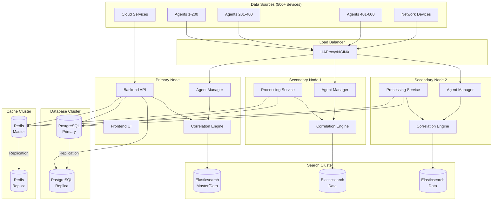

UTMStack supports horizontal scaling for large enterprise deployments handling more than 500 data sources. This page explains the architecture and configuration for multi-node deployments.

<Info>
**When to Scale Horizontally**: Going above 500 data sources/devices requires adding secondary nodes for horizontal scaling (from README.md:94).
</Info>

## Scaling Architecture



## Single-Node vs Multi-Node

### Single-Node Deployment

**Capacity**: Up to 500 data sources (1 TB/month)

**Resource Requirements**:
- CPU: 32 cores
- RAM: 64 GB
- Disk: 1 TB SSD

**Components on Single Server**:
- Backend API
- Frontend UI
- Correlation Engine
- Agent Manager
- PostgreSQL
- Elasticsearch (single node)
- Redis

**Advantages**:
- Simple deployment and management
- Lower infrastructure costs
- No network latency between components
- Easier troubleshooting

**Limitations**:
- Single point of failure
- Limited vertical scaling
- Cannot exceed 500 data sources efficiently

### Multi-Node Deployment

**Capacity**: 500+ to 10,000+ data sources

**Architecture**:
- Primary node: Management and core services
- Secondary nodes: Distributed processing
- Database cluster: High availability and read scaling
- Search cluster: Distributed indexing and search

**Advantages**:
- Horizontal scalability
- High availability
- Load distribution
- Fault tolerance
- Better performance under heavy load

## Deployment Topology

### Small Multi-Node (500-1500 sources)

**Node Configuration**:

| Node | Role | Components | Resources |
|------|------|------------|----------|
| Primary | Management | Backend API, Frontend, PostgreSQL Master, Redis Master | 32 cores, 64 GB RAM, 500 GB SSD |
| Secondary 1 | Processing | Agent Manager, Correlation, Elasticsearch Data | 32 cores, 64 GB RAM, 2 TB SSD |
| Secondary 2 | Processing | Agent Manager, Correlation, Elasticsearch Data | 32 cores, 64 GB RAM, 2 TB SSD |

**Total Capacity**: ~1,500 data sources, ~3 TB/month

### Medium Multi-Node (1500-5000 sources)

**Node Configuration**:

| Node | Role | Components | Resources |
|------|------|------------|----------|
| Primary | Management | Backend API, Frontend | 32 cores, 64 GB RAM, 500 GB SSD |
| Database | Database | PostgreSQL Primary + Replica | 32 cores, 128 GB RAM, 1 TB SSD |
| Search 1 | Search Master | Elasticsearch Master + Data | 32 cores, 128 GB RAM, 4 TB SSD |
| Search 2 | Search Data | Elasticsearch Data | 32 cores, 128 GB RAM, 4 TB SSD |
| Search 3 | Search Data | Elasticsearch Data | 32 cores, 128 GB RAM, 4 TB SSD |
| Worker 1 | Processing | Agent Manager, Correlation | 32 cores, 64 GB RAM, 500 GB SSD |
| Worker 2 | Processing | Agent Manager, Correlation | 32 cores, 64 GB RAM, 500 GB SSD |
| Worker 3 | Processing | Agent Manager, Correlation | 32 cores, 64 GB RAM, 500 GB SSD |

**Total Capacity**: ~5,000 data sources, ~10 TB/month

### Large Multi-Node (5000-10000 sources)

**Node Configuration**:

| Node Count | Type | Purpose | Resources per Node |
|------------|------|---------|-------------------|
| 2 | Management | API, Frontend, Load Balancing | 32 cores, 64 GB RAM, 500 GB SSD |
| 3 | Database | PostgreSQL Cluster | 64 cores, 256 GB RAM, 2 TB SSD |
| 5 | Search | Elasticsearch Cluster | 64 cores, 256 GB RAM, 8 TB SSD |
| 8 | Processing | Agent Managers, Correlation | 32 cores, 64 GB RAM, 1 TB SSD |
| 2 | Cache | Redis Cluster | 16 cores, 32 GB RAM, 200 GB SSD |

**Total Capacity**: ~10,000 data sources, ~20 TB/month

## Component Scaling Strategies

### Backend API Scaling

**Stateless Design**: All API instances share:
- PostgreSQL for persistent data
- Redis for session storage
- Elasticsearch for log queries

**Load Balancing Configuration** (NGINX):
```nginx
upstream utmstack_backend {
    least_conn;
    server primary:8080 weight=2;
    server worker1:8080;
    server worker2:8080;
    keepalive 32;
}

server {
    listen 443 ssl http2;
    server_name utmstack.company.com;
    
    ssl_certificate /etc/ssl/utmstack.crt;
    ssl_certificate_key /etc/ssl/utmstack.key;
    
    location /api/ {
        proxy_pass http://utmstack_backend;
        proxy_http_version 1.1;
        proxy_set_header Connection "";
        proxy_set_header Host $host;
        proxy_set_header X-Real-IP $remote_addr;
        proxy_set_header X-Forwarded-For $proxy_add_x_forwarded_for;
        proxy_set_header X-Forwarded-Proto $scheme;
    }
    
    location /websocket {
        proxy_pass http://utmstack_backend;
        proxy_http_version 1.1;
        proxy_set_header Upgrade $http_upgrade;
        proxy_set_header Connection "upgrade";
    }
}
```

**Health Checks**:
```nginx
upstream utmstack_backend {
    server primary:8080 max_fails=3 fail_timeout=30s;
    server worker1:8080 max_fails=3 fail_timeout=30s;
    server worker2:8080 max_fails=3 fail_timeout=30s;
    
    check interval=3000 rise=2 fall=3 timeout=1000 type=http;
    check_http_send "GET /actuator/health HTTP/1.0\r\n\r\n";
    check_http_expect_alive http_2xx http_3xx;
}
```

### Agent Manager Scaling

**gRPC Load Balancing**:

```yaml
# HAProxy configuration for gRPC
global
    maxconn 50000
    
defaults
    mode tcp
    timeout connect 10s
    timeout client 30s
    timeout server 30s
    
frontend grpc_frontend
    bind *:50051
    mode tcp
    default_backend grpc_backend
    
backend grpc_backend
    mode tcp
    balance roundrobin
    
    # Health check
    option tcp-check
    tcp-check connect
    
    server primary 10.0.1.10:50051 check
    server worker1 10.0.1.11:50051 check
    server worker2 10.0.1.12:50051 check
```

**Agent Configuration**:
```yaml
# Agents connect to load balancer
server: grpc-lb.utmstack.local:50051
agent_key: ${AGENT_KEY}

# Connection pooling
connection_pool:
  max_connections: 10
  min_connections: 2
  keepalive_time: 60s
```

### PostgreSQL Scaling

**Master-Replica Setup**:

**Master Configuration** (`postgresql.conf`):
```conf
# Replication
wal_level = replica
max_wal_senders = 10
max_replication_slots = 10
wal_keep_size = 1GB

# Performance
shared_buffers = 16GB
effective_cache_size = 48GB
maintenance_work_mem = 2GB
work_mem = 64MB
max_connections = 200

# Write performance
wal_buffers = 16MB
checkpoint_completion_target = 0.9
max_wal_size = 4GB
```

**Replica Configuration** (add to `postgresql.conf`):
```conf
hot_standby = on
max_standby_streaming_delay = 30s
wal_receiver_status_interval = 10s
hot_standby_feedback = on
```

**Application Configuration**:
```yaml
spring:
  datasource:
    # Write operations go to master
    url: jdbc:postgresql://pg-master:5432/utmstack
    
  # Read-only queries can use replica
  datasource-readonly:
    url: jdbc:postgresql://pg-replica:5432/utmstack
    hikari:
      read-only: true
```

**Connection Routing**:
```java
@Configuration
public class DatabaseConfig {
    @Bean
    @Primary
    public DataSource dataSource() {
        return DataSourceBuilder.create()
            .url("jdbc:postgresql://pg-master:5432/utmstack")
            .build();
    }
    
    @Bean(name = "readOnlyDataSource")
    public DataSource readOnlyDataSource() {
        return DataSourceBuilder.create()
            .url("jdbc:postgresql://pg-replica:5432/utmstack")
            .build();
    }
}

@Service
public class ReportService {
    @Autowired
    @Qualifier("readOnlyDataSource")
    private DataSource readOnlyDataSource;
    
    public List<Report> generateReport() {
        // Use read replica for heavy queries
        JdbcTemplate jdbc = new JdbcTemplate(readOnlyDataSource);
        return jdbc.query("SELECT ...", new ReportMapper());
    }
}
```

### Elasticsearch Cluster

**3-Node Cluster Configuration**:

**Master + Data Node** (es-master):
```yaml
cluster.name: utmstack
node.name: es-master
node.master: true
node.data: true
node.ingest: true

network.host: 0.0.0.0
http.port: 9200
transport.port: 9300

discovery.seed_hosts:
  - es-master:9300
  - es-data1:9300
  - es-data2:9300

cluster.initial_master_nodes:
  - es-master

# Memory
bootstrap.memory_lock: true

# Paths
path.data: /var/lib/elasticsearch
path.logs: /var/log/elasticsearch
```

**Data Nodes** (es-data1, es-data2):
```yaml
cluster.name: utmstack
node.name: es-data1  # or es-data2
node.master: false
node.data: true
node.ingest: true

network.host: 0.0.0.0
http.port: 9200
transport.port: 9300

discovery.seed_hosts:
  - es-master:9300
  - es-data1:9300
  - es-data2:9300
```

**Shard Allocation**:
```json
{
  "settings": {
    "number_of_shards": 6,
    "number_of_replicas": 1,
    
    "routing.allocation.awareness.attributes": "zone",
    "routing.allocation.total_shards_per_node": 3
  }
}
```

**Client Configuration**:
```java
@Configuration
public class ElasticsearchConfig {
    @Bean
    public RestHighLevelClient client() {
        return new RestHighLevelClient(
            RestClient.builder(
                new HttpHost("es-master", 9200, "http"),
                new HttpHost("es-data1", 9200, "http"),
                new HttpHost("es-data2", 9200, "http")
            )
            .setRequestConfigCallback(builder -> 
                builder.setConnectTimeout(5000)
                    .setSocketTimeout(60000)
            )
            .setHttpClientConfigCallback(httpClientBuilder ->
                httpClientBuilder.setMaxConnTotal(100)
                    .setMaxConnPerRoute(30)
            )
        );
    }
}
```

### Redis Cluster

**Master-Replica Configuration**:

**Master** (redis-master):
```conf
bind 0.0.0.0
port 6379
requirepass ${REDIS_PASSWORD}

# Replication
repl-diskless-sync yes
repl-diskless-sync-delay 5

# Memory
maxmemory 16gb
maxmemory-policy allkeys-lru

# Persistence
appendonly yes
appendfilename "appendonly.aof"
appendfsync everysec
```

**Replica** (redis-replica):
```conf
bind 0.0.0.0
port 6379
replicaof redis-master 6379
masterauth ${REDIS_PASSWORD}
requirepass ${REDIS_PASSWORD}

# Read-only
replica-read-only yes
```

**Sentinel for High Availability**:
```conf
port 26379
sentinel monitor utmstack-redis redis-master 6379 2
sentinel auth-pass utmstack-redis ${REDIS_PASSWORD}
sentinel down-after-milliseconds utmstack-redis 5000
sentinel parallel-syncs utmstack-redis 1
sentinel failover-timeout utmstack-redis 10000
```

**Application Configuration**:
```yaml
spring:
  redis:
    sentinel:
      master: utmstack-redis
      nodes:
        - sentinel1:26379
        - sentinel2:26379
        - sentinel3:26379
    password: ${REDIS_PASSWORD}
```

## Monitoring Multi-Node Deployment

### Key Metrics

**Per-Node Metrics**:
- CPU usage
- Memory usage
- Disk I/O
- Network throughput
- Process count

**Application Metrics**:
- Request rate per node
- Response time per node
- Error rate per node
- Queue depth
- Cache hit rate

**Database Metrics**:
- Replication lag
- Connection pool usage
- Query performance
- Lock contention

**Search Cluster Metrics**:
- Cluster health (green/yellow/red)
- Shard allocation
- Indexing rate
- Search rate
- JVM heap usage

### Monitoring Stack

**Prometheus Configuration**:
```yaml
scrape_configs:
  - job_name: 'utmstack-backend'
    static_configs:
      - targets:
        - primary:8080
        - worker1:8080
        - worker2:8080
    metrics_path: '/actuator/prometheus'
    
  - job_name: 'elasticsearch'
    static_configs:
      - targets:
        - es-master:9200
        - es-data1:9200
        - es-data2:9200
    metrics_path: '/_prometheus/metrics'
    
  - job_name: 'postgresql'
    static_configs:
      - targets:
        - pg-exporter:9187
```

## Migration Path

### From Single-Node to Multi-Node

**Phase 1: Add Secondary Processing Node**
1. Provision secondary node
2. Install UTMStack worker components
3. Configure to connect to primary database/search
4. Add to load balancer pool
5. Monitor performance

**Phase 2: Scale Database**
1. Set up PostgreSQL replication
2. Configure application for read replicas
3. Migrate heavy queries to replicas

**Phase 3: Scale Search Cluster**
1. Add Elasticsearch data nodes
2. Rebalance shards
3. Update index templates for more shards
4. Update application connection pool

**Phase 4: Add More Workers**
1. Add processing nodes as needed
2. Update load balancer configuration
3. Monitor and tune

## Next Steps

<CardGroup cols={2}>
  <Card title="High Availability" icon="server" href="/architecture/high-availability">
    Configure for maximum uptime
  </Card>
  <Card title="Performance Tuning" icon="gauge-high" href="/architecture/performance-tuning">
    Optimize multi-node performance
  </Card>
  <Card title="Data Storage" icon="database" href="/architecture/data-storage">
    Understand storage scaling
  </Card>
  <Card title="System Architecture" icon="sitemap" href="/architecture/system-architecture">
    Review overall architecture
  </Card>
</CardGroup>