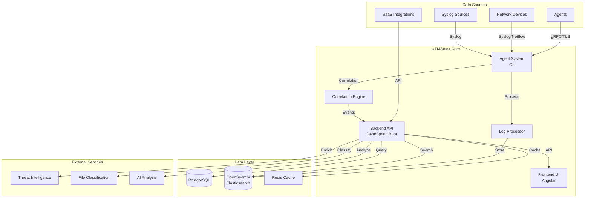

UTMStack is a unified threat management platform combining SIEM and XDR capabilities through a modern microservices architecture. The system is designed for real-time threat correlation, scalability, and enterprise-grade security.

## Architectural Overview

UTMStack follows a distributed microservices architecture with containerized components that communicate securely through encrypted channels. The platform processes security events in real-time, correlating data before ingestion to maximize efficiency.

## Key Architectural Principles

### 1. Microservices Isolation

All services are isolated using containers and microservices architecture with strong authentication. This design provides:

- **Security**: Each component runs in isolation with minimal privileges
- **Scalability**: Individual services can be scaled independently
- **Reliability**: Failures are contained and don't cascade across the system
- **Maintainability**: Services can be updated without affecting the entire platform

### 2. Real-Time Correlation

Unlike traditional SIEM systems, UTMStack performs correlation **before data ingestion**:

- Reduces storage and processing overhead
- Enables immediate threat detection
- Improves response times
- Minimizes false positives through context-aware analysis

### 3. Security-First Design

Every component is designed with security as a priority:

- All data in transit encrypted using TLS
- Agents authenticate with 24+ character unique keys
- User credentials encrypted in database
- Protected by fail2ban and 2FA
- Daily vulnerability scanning
- Regular penetration testing

### 4. Horizontal Scalability

The architecture supports scaling from small deployments to enterprise environments:

- Single-node deployments for up to 500 data sources
- Secondary nodes for horizontal scaling beyond 500 sources
- Load balancing across processing nodes
- Distributed storage with data sharding

## Technology Stack

### Backend Services
- **Framework**: Java 17 with Spring Boot 3.1.5
- **API**: RESTful services with SpringDoc OpenAPI
- **Security**: Spring Security with JWT and SAML2
- **Database**: PostgreSQL with Hibernate ORM
- **Search**: Elasticsearch 7.12.1 / OpenSearch
- **Communication**: gRPC for agent communication
- **Caching**: Caffeine cache

### Frontend Application
- **Framework**: Angular 7.2.0
- **Visualization**: ECharts 4.x with multiple plugins
- **UI Components**: ng-bootstrap, ng-select
- **State Management**: RxJS 6.3.3
- **WebSocket**: SockJS with STOMP protocol

### Agent System
- **Language**: Go (Golang)
- **Protocol**: gRPC with Protocol Buffers
- **Collectors**: Filebeat integration
- **Parsers**: Netflow (v1, v5, v6, v7, v9), IPFIX, Syslog
- **Storage**: Local SQLite for buffering

### Data Storage
- **Relational**: PostgreSQL for structured data, configuration, and metadata
- **Search Engine**: OpenSearch/Elasticsearch for log data and full-text search
- **Cache**: Redis for session management and performance optimization

## Component Communication

### Agent-to-Server
- **Protocol**: gRPC over TLS
- **Authentication**: Unique agent keys (24+ characters)
- **Data Flow**: Bidirectional for commands and log streaming
- **Ports**: Configurable (default agent manager port)

### Frontend-to-Backend
- **Protocol**: HTTPS/WebSocket
- **Authentication**: JWT tokens
- **API Style**: RESTful JSON APIs
- **Real-time**: WebSocket for live updates and alerts

### Backend-to-Storage
- **PostgreSQL**: JDBC connection pooling (HikariCP)
- **Elasticsearch**: REST High Level Client
- **Redis**: Spring Data Redis

## Deployment Architecture

### Single-Node Deployment
Optimal for small to medium deployments (up to 500 data sources):

- All components run on a single server
- Containerized services managed by Docker
- Resource requirements scale with data sources
- Hot log storage for configurable retention period

### Multi-Node Deployment
Required for large enterprise deployments (500+ data sources):

- Primary node runs core services
- Secondary nodes handle additional processing capacity
- Distributed log storage across nodes
- Load balancing for high availability

## Security Architecture

### Network Security
- TLS 1.2+ for all encrypted communications
- Certificate-based authentication for agents
- Firewall rules restrict access to management interfaces
- Network segmentation between components

### Application Security
- Container isolation with minimal attack surface
- Strong authentication for all services
- Role-based access control (RBAC)
- Encrypted credentials in database
- Audit logging for all administrative actions

### Data Security
- Encryption at rest for sensitive data
- Encryption in transit for all communications
- Regular security scanning and patching
- Penetration testing after major releases

## Next Steps

<CardGroup cols={2}>
  <Card title="Components" icon="puzzle-piece" href="/architecture/components">
    Detailed overview of all system components
  </Card>
  <Card title="Data Flow" icon="diagram-project" href="/architecture/data-flow">
    How data flows through the system
  </Card>
  <Card title="Horizontal Scaling" icon="arrows-left-right" href="/architecture/horizontal-scaling">
    Scale beyond 500 data sources
  </Card>
  <Card title="High Availability" icon="server" href="/architecture/high-availability">
    Configure for maximum uptime
  </Card>
</CardGroup>