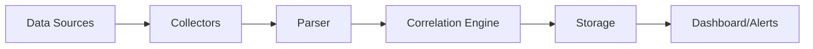

UTMStack provides flexible log collection capabilities to gather security data from your entire infrastructure. The platform supports multiple collection methods and protocols.

## Collection architecture

UTMStack's log collection architecture consists of:

1. **Collection layer**: Agents, syslog receivers, and API connectors
2. **Parsing layer**: Log normalization and field extraction
3. **Storage layer**: Indexed data in OpenSearch/Elasticsearch
4. **Correlation layer**: Real-time event correlation



## Collection methods

### Agent-based collection

Deploy UTMStack agents on Windows and Linux endpoints:

<Tabs>
  <Tab title="Windows">
    ```powershell
    # Download and install Windows agent
    Invoke-WebRequest -Uri "https://your-utm-server/downloads/utmstack-agent.exe" -OutFile "utmstack-agent.exe"
    .\utmstack-agent.exe install
    ```
    
    Agents collect:
    - Windows Event Logs
    - Sysmon events
    - Application logs
    - File integrity monitoring data
  </Tab>
  <Tab title="Linux">
    ```bash
    # Download and install Linux agent
    wget https://your-utm-server/downloads/utmstack-agent
    chmod +x utmstack-agent
    sudo ./utmstack-agent install
    ```
    
    Agents collect:
    - Syslog messages
    - Auth logs
    - System logs
    - Application logs
  </Tab>
</Tabs>

<Info>
  See [Agent Management](/agents/overview) for detailed agent installation and configuration.
</Info>

### Syslog collection

Configure network devices and applications to send syslog to UTMStack:

```bash
# UTMStack listens on these ports for syslog
UDP 514  # Standard syslog
TCP 514  # Reliable syslog
TCP 6514 # TLS syslog (encrypted)
```

**Supported syslog formats**:
- RFC 3164 (BSD syslog)
- RFC 5424 (New syslog format)
- CEF (Common Event Format)
- LEEF (Log Event Extended Format)

### Filebeat collection

For file-based log collection, configure Filebeat to ship logs:

```yaml filebeat.yml
filebeat.inputs:
  - type: log
    enabled: true
    paths:
      - /var/log/application/*.log
    fields:
      log_type: application
      environment: production

output.logstash:
  hosts: ["utm-server:5044"]
  ssl.certificate_authorities: ["/etc/filebeat/ca.crt"]
```

### API-based collection

For cloud platforms and SaaS applications, UTMStack uses API connectors:

- **AWS**: CloudWatch Logs API and S3 bucket monitoring
- **Azure**: Azure Monitor API
- **GCP**: Cloud Logging API
- **Office 365**: Management Activity API

<Note>
  API-based collection requires proper authentication credentials. See [Integrations](/integrations/overview).
</Note>

## Data parsing

UTMStack includes 30+ pre-built parsers for common log formats:

<Accordion title="View supported log formats">
  - Antivirus logs (Bitdefender, Sophos, etc.)
  - AWS CloudTrail
  - Azure Activity Logs
  - Cisco ASA, IOS
  - CrowdStrike Falcon
  - Fortinet FortiGate
  - GitHub audit logs
  - Google Workspace
  - Linux syslog
  - macOS logs
  - Microsoft Office 365
  - Mikrotik RouterOS
  - NetFlow/IPFIX
  - Palo Alto Networks
  - pfSense
  - SonicWall
  - Suricata IDS
  - VMware vCenter
  - Windows Event Logs
</Accordion>

Parsers extract structured fields from raw logs:

```json
{
  "@timestamp": "2024-03-03T12:34:56.000Z",
  "source_ip": "192.168.1.100",
  "destination_ip": "10.0.0.50",
  "source_port": 54321,
  "destination_port": 443,
  "protocol": "tcp",
  "action": "allowed",
  "user": "john.doe",
  "application": "web-proxy",
  "bytes_sent": 1024,
  "bytes_received": 4096
}
```

## Collection performance

**Throughput limits** (per UTMStack server):

| Server Size | Events/Second | Daily Volume |
|------------|---------------|-------------|
| Small (4 cores, 16GB) | 5,000 | 400M events |
| Medium (8 cores, 16GB) | 10,000 | 850M events |
| Large (16 cores, 32GB) | 20,000 | 1.7B events |
| XLarge (32 cores, 64GB) | 40,000+ | 3.4B+ events |

<Warning>
  For deployments exceeding 40,000 events/second, implement horizontal scaling with secondary nodes.
</Warning>

## Monitoring collection health

Monitor collection status in the UTMStack dashboard:

1. Navigate to **Data Sources** → **Status**
2. View real-time metrics:
   - Events per second
   - Parser success rate
   - Data source connectivity
   - Parsing errors

```bash
# Check data input status via API
curl -X GET "https://utm-server/api/utm-data-input-status" \
  -H "Authorization: Bearer $TOKEN"
```

## Best practices

<Accordion title="Optimize log collection">
  1. **Use agents for endpoints**: More reliable than syslog forwarding
  2. **Enable TLS for syslog**: Encrypt logs in transit
  3. **Implement log filtering**: Filter noisy sources at the collector
  4. **Monitor collection rates**: Set up alerts for collection failures
  5. **Balance data sources**: Distribute high-volume sources across collectors
</Accordion>

<Accordion title="Troubleshoot collection issues">
  **No data from source**:
  - Verify network connectivity
  - Check firewall rules
  - Validate authentication credentials
  - Review parser configuration
  
  **High parsing error rate**:
  - Check log format matches parser
  - Review parsing error logs
  - Consider custom parser
  
  **Performance degradation**:
  - Check CPU and memory usage
  - Review event rate trends
  - Consider horizontal scaling
</Accordion>

## Next steps

<CardGroup cols={2}>
  <Card title="Configure syslog" href="/data-sources/syslog">
    Set up syslog receivers
  </Card>
  <Card title="Deploy Filebeat" href="/data-sources/filebeat">
    Configure file-based collection
  </Card>
  <Card title="Custom parsers" href="/data-sources/custom-parsers">
    Create custom log parsers
  </Card>
  <Card title="Monitor health" href="/operations/dashboards">
    Monitor collection metrics
  </Card>
</CardGroup>